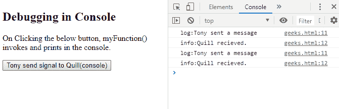
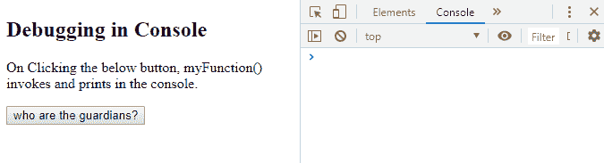
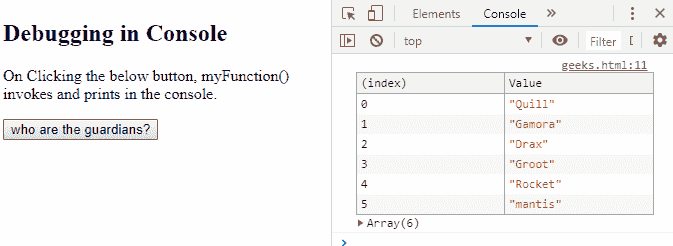

# 如何在谷歌 Chrome JavaScript 控制台打印调试消息？

> 原文:[https://www . geesforgeks . org/how-print-debug-messages-in-Google-chrome-JavaScript-console/](https://www.geeksforgeeks.org/how-to-print-debug-messages-in-the-google-chrome-javascript-console/)

在控制台中打印非常容易，我们只需要知道如何激活 chrome 上的控制台进行查看。控制台总是活动的，我们所做的就是让它对前端可见。控制台是提供对浏览器调试控制台的访问的对象。Console 对象有很多方法可以帮助我们打印定制调试。

以下是一些方法:

*   **assert():** 行为类似“if”，如果为 false 则打印到控制台。
*   **清除():**清除控制台。
*   **count():** 每当被调用时都会计数。
*   **错误():**打印错误(如果有)。
*   **组():**在控制台中创建新的内联组。
*   **组折叠():**在控制台中创建新的内联折叠组。
*   **groupEnd():** 退出控制台中的内联组。
*   **info():** 只是作为日志，用于优先级信息。
*   **log():** 向控制台输出消息。
*   **表格():**将表格数据显示为表格。
*   **time():** 跟踪特定任务发生的时间。
*   **timeEnd():** 结束追踪器。
*   **trace():** 输出堆栈跟踪。
*   **warn():** 输出警告信息。

> 运行脚本后，单击 F12，它将打开开发人员工具，导航到控制台选项卡，该选项卡将位于顶部菜单上。

**例 1:**

```
<!DOCTYPE html>
<html>

<body>

    <h2>Debugging in Console</h2>

    <p>On Clicking the below button,
      myFunction() invokes and prints in the console.</p>
    <input type="button"
           onclick="myFunction()"
           value="Tony send signal to Quill(console)">
    <!--button-->
    <script>
        function myFunction() {
            //prints in console
            console.log("log:Tony sent a message"); 

            //prints in console
            console.info("info:Quill recieved."); 
        }
    </script>

</body>

</html>
```

**输出:**
**前:**

[](https://contribute.geeksforgeeks.org/?attachment_id=1270379)

输出 1

**After clicking the button:**
[](https://contribute.geeksforgeeks.org/?attachment_id=1270380)

输出 2

**示例 2:** 查看 console.table()以更好地理解方法。

```
<!DOCTYPE html>
<html>

<body>

    <h2>Debugging in Console</h2>

    <p>On Clicking the below button, 
      myFunction() invokes and prints in the console.</p>
    <input type="button" 
           onclick="myFunction()" 
           value="who are the guardians?">
    <script>
        function myFunction() {
            console.table(["Quill", "Gamora", "Drax",
                           "Groot", "Rocket", "mantis"]);
        }
    </script>

</body>

</html>
```

**输出**
**前:**

[](https://contribute.geeksforgeeks.org/?attachment_id=1270397)

输出 1

**After Clicking the button:**
[](https://contribute.geeksforgeeks.org/?attachment_id=1270398)

输出 2