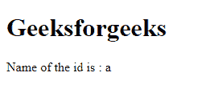
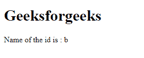
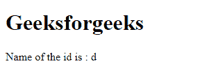

# 如何在 JavaScript 中按对象数组中的 id 打印对象？

> 原文:[https://www . geesforgeks . org/如何通过 javascript 中的对象数组中的 id 打印对象/](https://www.geeksforgeeks.org/how-to-print-object-by-id-in-an-array-of-objects-in-javascript/)

我们有一个对象数组，在每个对象中，有一个名为 **id** 的键，其值是一个数字。

**示例:**

```
const arr = [
        {
            'id' : 12, 
            'name' : 'Ram'
         }, 
         {
             'id' : 32, 
             'name' : 'Shyam'
         }
          ]
```

我们想找到 id 号为 **n** 的 name 属性的值。

**示例:**

```
Input : 12
Output : Ram

Input : 32
Output : Shyam
```

有许多方法可以解决这个问题，如下

*   使用 [**阵列滤波器()**](https://www.geeksforgeeks.org/javascript-array-filter-method/)
*   [**阵法()**](https://www.geeksforgeeks.org/javascript-array-find-method/)
*   使用 JavaScript 中的 [**循环**](https://www.geeksforgeeks.org/loops-in-javascript/)

**使用 Array.filter( )** Array.filter()方法用于在应用一些条件后，从现有数组创建一个新数组。

## 超文本标记语言

```
<!DOCTYPE html>
<html>
    <body>
        <h1>Geeksforgeeks</h1>

        <p>Name of the id is : 
          <span id="geeks"></span>
        </p>

        <script>

            // This is our array of Objects
            var data = [
                { id: 1, name: "a" },
                { id: 2, name: "b" },
                { id: 3, name: "c" },
                { id: 4, name: "d" },
                { id: 5, name: "e" },
                { id: 6, name: "f" },
            ];

            let idYouWant = 1;
            let propertyYouWant = "name";

            // Using Array.filter( ) method
            // we are iterating through each
            // items in the array and
            // checking which item's
            // id value is equal to the id we want

            let res = data.filter((item) => {
                return item.id == idYouWant;
            });

            // After using filter method we got an array
            // of object. Now take its first element and
            // use its 'propertyYouWant' key
            let exactRes = res[0][propertyYouWant];

            // Printing the property we want
            document.getElementById("geeks").innerText = exactRes;
        </script>
    </body>
</html>
```

**输出:**


**使用 Array.find( ):** 使用 Array.find()首先我们要搜索给定 id 存在于哪个对象中，然后我们从那个对象中提取 name 属性。

## 超文本标记语言

```
<!DOCTYPE html>
<html>
    <body>
        <h1>Geeksforgeeks</h1>

        <p>Name of the id is : 
          <span id="geeks"></span>
        </p>

        <script>

            // This is our array of Objects
            var data = [
                { id: 1, name: "a" },
                { id: 2, name: "b" },
                { id: 3, name: "c" },
                { id: 4, name: "d" },
                { id: 5, name: "e" },
                { id: 6, name: "f" },
            ];

            let idYouWant = 2;
            let propertyYouWant = "name";

            // Using Array.find( ) we are searching
            // in which object our searching id present

            let res = data.find((item) => {
                return item.id == idYouWant;
            });

            // Now print the property which you want from
            // the object res console.log(res[propertyYouWant])
            document.getElementById("geeks").innerText = 
                    res[propertyYouWant];
        </script>
    </body>
</html>
```

**输出:**


**使用 for 循环**使用 for 循环首先，我们迭代数组并搜索给定 id 出现在哪个对象中，然后，我们打印我们想要的属性。

## 超文本标记语言

```
<!DOCTYPE html>
<html>
    <body>
        <h1>Geeksforgeeks</h1>

        <p>Name of the id is :
          <span id="geeks"></span>
        </p>

        <script>
            // This is our array of objects
            var data = [
                { id: 1, name: "a" },
                { id: 2, name: "b" },
                { id: 3, name: "c" },
                { id: 4, name: "d" },
                { id: 5, name: "e" },
                { id: 6, name: "f" },
            ];

            let idYouWant = 4;
            let propertyYouWant = "name";

            // Iterating over the array using for loop and
            // searching in which object the id present
            // After getting the object we print the
            // property we wanted from the object

            for (var i = 0; i < data.length; i++) {
                if (data[i].id == idYouWant) {
                    // console.log(data[i][propertyYouWant])
                    document.getElementById("geeks").innerText = 
                            data[i][propertyYouWant];
                }
            }
        </script>
    </body>
</html>
```

**输出:**
