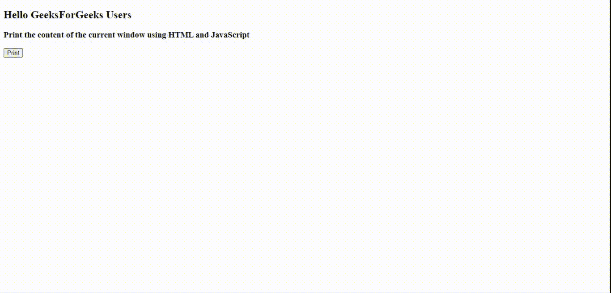
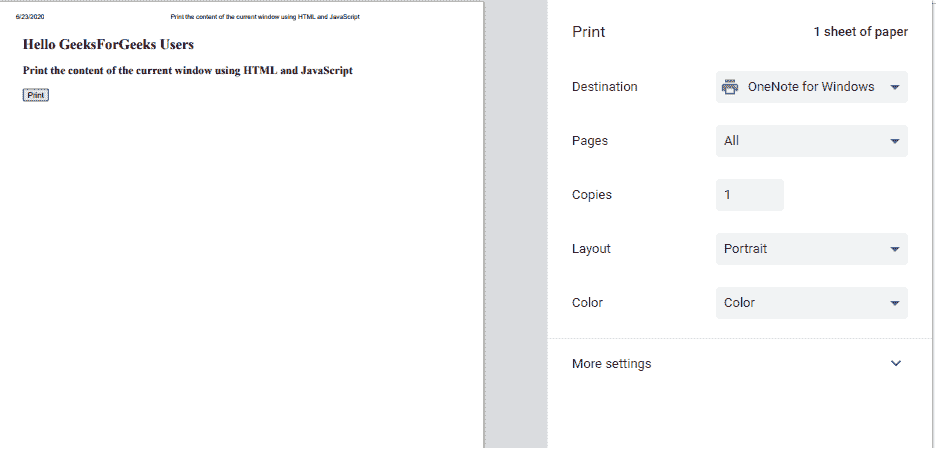

# 如何用 JavaScript 打印当前窗口的内容？

> 原文:[https://www . geesforgeks . org/如何使用 javascript 打印当前窗口的内容/](https://www.geeksforgeeks.org/how-to-print-the-content-of-current-window-using-javascript/)

任务是使用文档中的 **window.print()** 方法打印当前窗口的内容。用于打开打印对话框打印当前文档。它没有任何参数值。

**语法:**

```html
window.print()
```

**示例:**这个示例表示如何使用 JavaScript 打印当前窗口的内容。

```html
<!DOCTYPE html>
<html>

<body>
    <h1>Hello GeeksForGeeks Users</h1>

    <h3>
        Print the content of the current 
        window using HTML and JavaScript
    </h3>

    <form>
        <input type="button" value="Print" 
            onclick="print_current_page()" />
    </form>

    <script type="text/javascript">
        function print_current_page() {
            window.print();
        }
    </script>
</body>

</html>
```

**点击打印按钮前:**

**点击打印按钮后:**



**支持的浏览器如下:**

*   谷歌 Chrome
*   微软公司出品的 web 浏览器
*   火狐浏览器
*   歌剧
*   去旅行