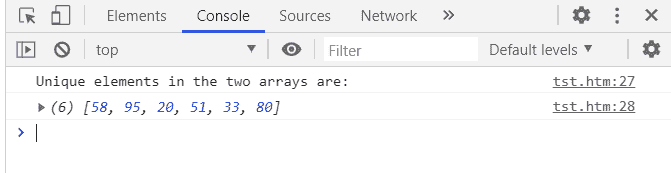

# 如何用 JavaScript 打印两个未排序数组的唯一元素？

> 原文:[https://www . geesforgeks . org/如何使用 javascript 从两个未排序的数组中打印唯一元素/](https://www.geeksforgeeks.org/how-to-print-unique-elements-from-two-unsorted-arrays-using-javascript/)

给定两个未排序的数组，任务是编写一个 JavaScript 程序来打印这两个数组中唯一的(不常见的)元素。

**进场:**

*   创建一个空数组来存储两个数组中的唯一元素。
*   使用循环迭代数组 1 的所有元素。
*   对于每次迭代，将初始标志值设置为 0。
*   在该循环中，使用另一个循环迭代数组 2 的所有元素，并检查数组 1[元素]是否存在于数组 2 中。
*   如果存在，使用 splice()方法从数组 2 中移除元素，并将标志设置为 1。
*   如果数组 1[元素]已经完全遍历了数组 2，并且标志仍然等于 0，则将数组 1[元素]添加到唯一元素数组中。
*   对数组 1 中的每个元素重复步骤 4-6。
*   最后，将数组 2 推送到唯一元素数组，因为所有重复的元素都已从数组 2 中移除(参见步骤 5)。

**示例:**下面给出了上述方法的实现:

## java 描述语言

```
<script>
function unique(arr1,arr2,uniqueArr) {
    for(var i=0; i<arr1.length; i++) {
        flag = 0;
        for(var j=0; j<arr2.length; j++) {
            if(arr1[i] === arr2[j]) {
                arr2.splice(j,1);
                j--;
                flag = 1;
            }
        }

        if(flag == 0) {
            uniqueArr.push(arr1[i]);
        }
    }
    uniqueArr.push(arr2);
    return uniqueArr;
}

var arr1 = [54, 71, 58, 95, 20];

var arr2 = [71, 51, 54, 33, 80];

var uniqueArr = [];

console.log("Unique elements in the two arrays are:");
console.log(unique(arr1,arr2,uniqueArr).flat());
</script>
```

**输出:**

