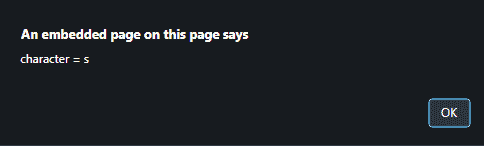
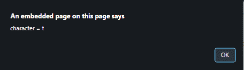
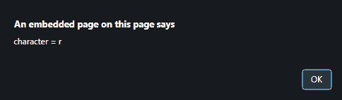

# 如何用 JavaScript 处理文本的每个字母？

> 原文:[https://www . geesforgeks . org/如何使用 javascript 处理每个文本字母/](https://www.geeksforgeeks.org/how-to-process-each-letter-of-text-using-javascript/)

给定一个字符串，任务是逐个字符地处理它。

*   **JavaScript String to ppercase()方法:**此方法将字符串转换为大写字母。
    **语法:**

```
string.toUpperCase()
```

*   **参数:**该方法接受单参数**字符串**，这是必需的。它指定要搜索的字符串。
    **返回值:**返回一个字符串，表示转换为大写的字符串的值。

*   **JavaScript String charAt()方法:**该方法返回字符串中传递的索引处的字符。字符索引从 0 开始。
    **语法:**

```
string.charAt(index)
```

*   **参数:**该方法接受单参数**指标**，这是必须的。它指定表示要返回的字符索引的整数。
    **返回值:**返回一个字符串，表示传递的索引处的字符，如果索引号无效，则返回一个空字符串。

**示例 1:** 本示例使用**进行循环**逐字母处理字符串，并将每个字母分别转换为大写。

## 超文本标记语言

```
<!DOCTYPE HTML>
<html>
    <head>
        <title>
            How to process each character of text
        </title>
    </head>

    <body style = "text-align:center;">

        <h1 style = "color:green;" >
            GeeksForGeeks
        </h1>

        <p id = "GFG_UP" style =
            "font-size: 15px; font-weight: bold;">
        </p>

        <button onclick = "gfg_Run()">
            check
        </button>

        <p id = "GFG_DOWN" style =
            "color:green; font-size: 20px; font-weight: bold;">
        </p>

        <script>
            var el_up = document.getElementById("GFG_UP");
            var el_down = document.getElementById("GFG_DOWN");
            var str = "This is String";
            el_up.innerHTML = "String = '"+str + "'";

            function gfg_Run() {
                var str_Upper = "";
                for (var i = 0; i < str.length; i++) {
                    str_Upper += str.charAt(i).toUpperCase();
                }
                el_down.innerHTML = str_Upper;
            }        
        </script>
    </body>
</html>                   
```

**输出:**

*   **点击按钮前:**


*   **点击按钮后:**


**示例 2:** 本示例使用**循环处理字符串字母**，并分别提醒每个字母。

## 超文本标记语言

```
<!DOCTYPE HTML>
<html>
    <head>
        <title>
            How to process each letter of text
        </title>
    </head>

    <body style = "text-align:center;">

        <h1 style = "color:green;" >
            GeeksForGeeks
        </h1>

        <p id = "GFG_UP" style =
            "font-size: 15px; font-weight: bold;">
        </p>

        <button onclick = "gfg_Run()">
            check
        </button>

        <script>
            var el_up = document.getElementById("GFG_UP");
            var str = "str";
            el_up.innerHTML = "String = '" + str + "'";

            function gfg_Run() {
                for (var i in str) {
                    alert(" character = "+str.charAt(i));
                }
            }        
        </script>
    </body>
</html>                   
```

**输出:**

*   **点击按钮前:**


*   **点击按钮后:**

  