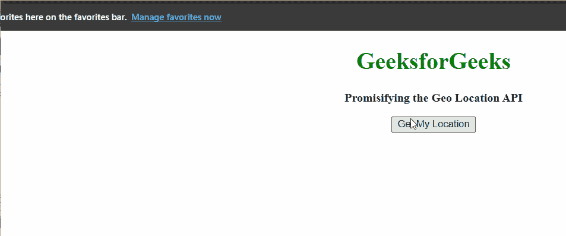

# 如何使用 JavaScript Promisify 地理定位 API 获取当前位置？

> 原文:[https://www . geesforgeks . org/how-to-promisify-geolocation-API-to-get-current-position-use-JavaScript/](https://www.geeksforgeeks.org/how-to-promisify-geolocation-api-to-get-current-position-using-javascript/)

在本文中，我们将使用 Promisify 地理定位应用编程接口到基于 Promise 的应用编程接口中。

**先决条件:** [JavaScript 承诺](https://www.geeksforgeeks.org/javascript-promises/)

**方法:**我们知道[navigator . geolocation . getcurrentposition](https://www.geeksforgeeks.org/html-navigator-geolocation-property/)是一个基于回调的 API，所以我们可以很容易地将其转换为基于 Promise 的 API。为了保证地理定位 API，我们将从浏览器中获取用户的当前位置。我们要么解决承诺，要么拒绝承诺，要么我们得到当前的位置。

**示例:**

## 超文本标记语言

```
<!DOCTYPE html>
<html>

<head>
    <meta charset="UTF-8" />

    <style>
        body {
            text-align: center;
        }

        h1 {
            color: green;
        }

        h5 {
            color: black;
        }

        #geeks {
            font-size: 16px;
            font-weight: bold;
        }

        #gfg {
            color: green;
            font-size: 20px;
            font-weight: bold;
        }
    </style>
</head>

<body>
    <h1>GeeksforGeeks</h1>
    <p id="geeks"></p>

    <button onClick="getLocation()">Get My Location</button>
    <p id="gfg"></p>

    <script>
        let s = `Promisifying the Geo Location API`;
        document.getElementById("geeks").innerHTML = `
<p>${s}</p>
`;

        // Logic start here
        let getLocationPromise = () => {
            return new Promise(function (resolve, reject) {

                // Promisifying the geolocation API
                navigator.geolocation.getCurrentPosition(
                    (position) => resolve(position),
                    (error) => reject(error)
                );
            });
        };

        function getLocation() {
            getLocationPromise()
                .then((res) => {

                    // If promise get resolved
                    const { coords } = res;
                    document.getElementById("gfg").innerHTML = `

<p>
           <strong>You are Located at :</strong>
          </p>

          <h5>latitude : ${coords.latitude}</h5>
          <h5>longitude : ${coords.longitude}</h5>
          `;
                })
                .catch((error) => {
                    // If promise get rejected
                    document.getElementById("gfg")
                        .innerHTML = `
<p>${error}</p>
`;
                });
        }
    </script>
</body>

</html>
```

**输出:**



承诺地理定位应用编程接口

**例 2:** 我们甚至可以简化前面的代码，让它变得更好。我们知道**导航器.地理位置. getCurrentPosition(回调，错误)**自动调用回调函数并传递位置。

## 超文本标记语言

```
<!DOCTYPE html>
<html>

<head>
    <meta charset="UTF-8" />
    <style>
        body {
            text-align: center;
        }

        h1 {
            color: green;
        }

        h5 {
            color: black;
        }

        #geeks {
            font-size: 16px;
            font-weight: bold;
        }

        #gfg {
            color: green;
            font-size: 20px;
            font-weight: bold;
        }
    </style>
</head>

<body>
    <h1>GeeksforGeeks</h1>
    <p id="geeks"></p>

    <button onClick="getLocation()">Get My Location</button>
    <p id="gfg"></p>

    <script>
        let s = `Promisifying the Geo Location API`;
        document.getElementById("geeks")
        .innerHTML = `
<p>${s}</p>
`;

        let getLocationPromise = () => {
            return new Promise(function (resolve, reject) {

                // Automatically passes the position
                // to the callback
                navigator.geolocation
                    .getCurrentPosition(resolve, reject);
            });
        };
        function getLocation() {
            getLocationPromise()
                .then((res) => {
                    // If promise get resolved
                    const { coords } = res;
                    document.getElementById("gfg").innerHTML = `

<p>
                <strong>You are Located at :</strong>
            </p>

            <h5>latitude : ${coords.latitude}</h5>
            <h5>longitude : ${coords.longitude}</h5>
            `;
                })
                .catch((error) => {
                    // If promise get rejected
                    document.getElementById("gfg").innerHTML
                             = `
<p>${error}</p>
`;
                    // Console.error(error);
                });
        }
    </script>
</body>

</html>
```

**输出:**


承诺地理定位应用编程接口