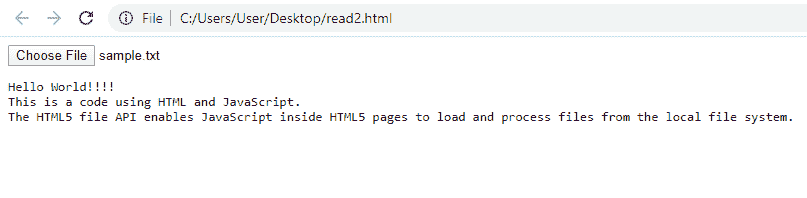

# 如何使用 JavaScript 读取本地文本文件？

> 原文:[https://www . geesforgeks . org/如何使用 javascript 读取本地文本文件/](https://www.geeksforgeeks.org/how-to-read-a-local-text-file-using-javascript/)

HTML 5 借助*文件 API* 提供了与本地文件交互的标准方式。文件应用编程接口允许与单个、多个以及 BLOB 文件进行交互。*文件阅读器应用编程接口*可用于与 JavaScript 事件处理协作异步读取文件。但是，所有的浏览器都不支持 HTML 5，所以在使用文件应用编程接口之前测试浏览器的兼容性是很重要的。文件阅读器应用编程接口中有四种读取本地文件的内置方法:

*   **file reader . readasaraybuffer():**读取指定输入文件的内容。结果属性包含一个代表文件数据的 ArrayBuffer。
*   **file reader . readasbinarystring():**读取指定输入文件的内容。result 属性以字符串形式包含文件中的原始二进制数据。
*   **file reader . readasdataurl():**读取指定输入文件的内容。结果属性包含一个代表文件数据的网址。
*   **FileReader.readAsText():** 读取指定输入文件的内容。结果属性包含文本字符串形式的文件内容。此方法可以将编码版本作为第二个参数(如果需要)。默认编码是 UTF-8。

在这种情况下，我们使用 FileReader.readAsText()方法读取本地**。txt 文件**。

```
<!DOCTYPE html>
<html>

<head>
    <title>Read Text File</title>
</head>

<body>
    <input type="file" name="inputfile"
            id="inputfile">
    <br>

    <pre id="output"></pre>

    <script type="text/javascript">
        document.getElementById('inputfile')
            .addEventListener('change', function() {

            var fr=new FileReader();
            fr.onload=function(){
                document.getElementById('output')
                        .textContent=fr.result;
            }

            fr.readAsText(this.files[0]);
        })
    </script>
</body>

</html>
```



这段代码打印的输入文件内容与输入文件中的内容完全相同。

JavaScript 最出名的是网页开发，但它也用于各种非浏览器环境。您可以通过以下 [JavaScript 教程](https://www.geeksforgeeks.org/javascript-tutorial/)和 [JavaScript 示例](https://www.geeksforgeeks.org/javascript-examples/)从头开始学习 JavaScript。