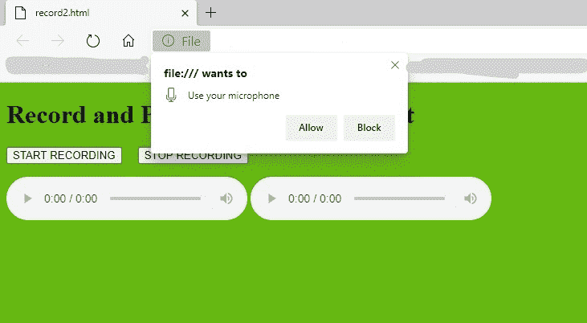
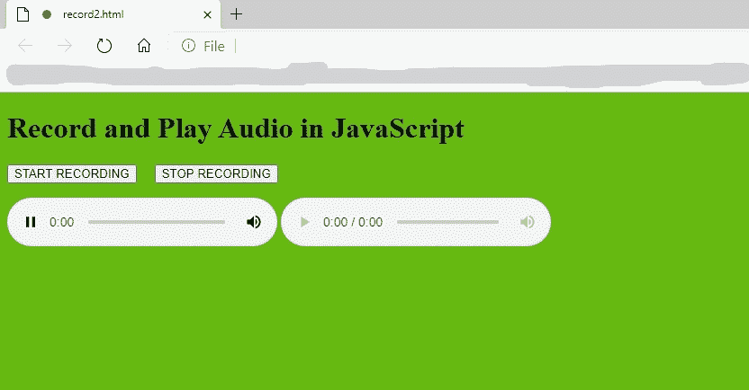

# 如何用 JavaScript 录制和播放音频？

> 原文:[https://www . geesforgeks . org/如何录制和播放 javascript 音频/](https://www.geeksforgeeks.org/how-to-record-and-play-audio-in-javascript/)

JavaScript 是一种非常灵活的语言，它提供了许多 API 支持来做许多有用的事情。这里重要的一点是，在网页中录制音频或视频也是使用 JavaScript 完成的。在这种情况下，它会要求用户使用麦克风访问浏览器，并通过麦克风录制音频，并将音频数据块以二进制值的形式保存在数组中，当我们播放音频时，然后检索 chuck 数据并开始播放。同样的事情也发生在视频上，当我们进行视频会议时，这实际上发生在服务器上，唯一的事情是我们在同一页面播放视频，如果是视频会议，视频将在另一端播放。

整个事情都是用一个 API 发生的，就是 **MediaRecorder** API。该应用编程接口提供记录媒体(如音频或视频)的功能。它是使用**媒体记录器()**构造器创建的。

这里我们使用 JavaScript 的一个属性，即 **mediaDevices** 属性，用于访问麦克风、网络摄像头等连接的输入媒体设备。该属性使用方法 **getUserMedia()** 获取访问麦克风、网络摄像头等的权限。该方法向**导航器**对象返回*承诺*。

**承诺如下:**

**如果为真:**

*   **解析:**如果实现了所有权限，并且麦克风或摄像头工作正常，则返回一个 **MediaStream** 对象。这是主要记录的数据。

**如果为假:**

*   **不允许错误:**如果用户拒绝录制许可。
*   **未找到错误:**如果没有媒体轨道。
*   **NotReadableError:** 如果没有找到输入设备或者硬件不工作。
*   **过约束错误:**如果约束音频设置阻止。
*   **流产:**如果发现一般的不明原因。
*   **类型错误:**如果**音频:假**在 Javascript 代码中声明。

**示例:**

```html
<!DOCTYPE html>
<html>

<head>
  <script>

    let audioIN = { audio: true };
    //  audio is true, for recording

    // Access the permission for use
    // the microphone
    navigator.mediaDevices.getUserMedia(audioIN)

      // 'then()' method returns a Promise
      .then(function (mediaStreamObj) {

        // Connect the media stream to the
        // first audio element
        let audio = document.querySelector('audio');
        //returns the recorded audio via 'audio' tag

        // 'srcObject' is a property which 
        // takes the media object
        // This is supported in the newer browsers
        if ("srcObject" in audio) {
          audio.srcObject = mediaStreamObj;
        }
        else {   // Old version
          audio.src = window.URL
            .createObjectURL(mediaStreamObj);
        }

        // It will play the audio
        audio.onloadedmetadata = function (ev) {

          // Play the audio in the 2nd audio
          // element what is being recorded
          audio.play();
        };

        // Start record
        let start = document.getElementById('btnStart');

        // Stop record
        let stop = document.getElementById('btnStop');

        // 2nd audio tag for play the audio
        let playAudio = document.getElementById('adioPlay');

        // This is the main thing to recorde 
        // the audio 'MediaRecorder' API
        let mediaRecorder = new MediaRecorder(mediaStreamObj);
        // Pass the audio stream 

        // Start event
        start.addEventListener('click', function (ev) {
          mediaRecorder.start();
          // console.log(mediaRecorder.state);
        })

        // Stop event
        stop.addEventListener('click', function (ev) {
          mediaRecorder.stop();
          // console.log(mediaRecorder.state);
        });

        // If audio data available then push 
        // it to the chunk array
        mediaRecorder.ondataavailable = function (ev) {
          dataArray.push(ev.data);
        }

        // Chunk array to store the audio data 
        let dataArray = [];

        // Convert the audio data in to blob 
        // after stopping the recording
        mediaRecorder.onstop = function (ev) {

          // blob of type mp3
          let audioData = new Blob(dataArray, 
                    { 'type': 'audio/mp3;' });

          // After fill up the chunk 
          // array make it empty
          dataArray = [];

          // Creating audio url with reference 
          // of created blob named 'audioData'
          let audioSrc = window.URL
              .createObjectURL(audioData);

          // Pass the audio url to the 2nd video tag
          playAudio.src = audioSrc;
        }
      })

      // If any error occurs then handles the error 
      .catch(function (err) {
        console.log(err.name, err.message);
      });
  </script>
</head>

<body style="background-color:rgb(101, 185, 17); ">
  <header>
    <h1>Record and Play Audio in JavaScript</h1>
  </header>
  <!--button for 'start recording'-->
  <p>
    <button id="btnStart">START RECORDING</button>

    <button id="btnStop">STOP RECORDING</button>
    <!--button for 'stop recording'-->
  </p>

  <!--for record-->
  <audio controls></audio>
  <!--'controls' use for add 
    play, pause, and volume-->

  <!--for play the audio-->
  <audio id="adioPlay" controls></audio>
</body>

</html>
```

**输出:**


