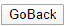
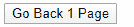

# 如何使用 JavaScript 将浏览器窗口重定向回来？

> 原文:[https://www . geesforgeks . org/how-redirect-browser-window-back-use-JavaScript/](https://www.geeksforgeeks.org/how-to-redirect-browser-window-back-using-javascript/)

在本文中，我们将使用 JavaScript 将浏览器窗口重定向回来。有两种方法用于重定向浏览器窗口。

**方法 1:** **[使用 history.back()方法:](https://www.geeksforgeeks.org/html-dom-history-back-method/)**window . history 对象的 back()方法用于返回当前会话历史中的上一页。如果没有上一页，这个方法不会调用任何东西。可以用此方法指定 onclick 事件，以返回历史记录中的一页。

**语法:**

```
history.back()
```

**示例 1:** 本示例使用 history.back()方法将浏览器重定向到上一页。

```
<html>

<head>
    <script>
        function Previous() {
            window.history.back()
        }
    </script>
</head>

<body>

    <input type="button" 
           value="GoBack"
           onclick="Previous()">

</body>

</html>
```

**输出:**


**方法 2:** **[使用 history.go()方法:](https://www.geeksforgeeks.org/html-dom-history-go-method/)**window . history 对象的 history.go()方法用于从会话历史加载页面。它可用于使用 delta 参数的值向前或向后移动。一个正的增量参数意味着页面将在历史中前进。同样，负增量值会使页面返回到上一页。
该方法可以使用“-1”作为增量值，在历史中返回一页。onclick 事件可以用方法指定，以返回历史记录中的一页。

**语法:**

```
history.ho(number\URL)
```

**示例 2:** 本示例使用 window.history.go()方法将浏览器重定向到上一页。

```
<!DOCTYPE html>
<html>

<body>
    <button onclick="Previous()">Go Back 1 Page</button>
    <script>
        function Previous() {
            window.history.go(-1);
        }
    </script>
</body>

</html>
```

**输出:**


**注意:**如果历史列表中不存在上一页，则此方法不起作用。

**支持的浏览器:**

*   谷歌 Chrome
*   微软公司出品的 web 浏览器
*   火狐浏览器
*   苹果 Safari
*   歌剧