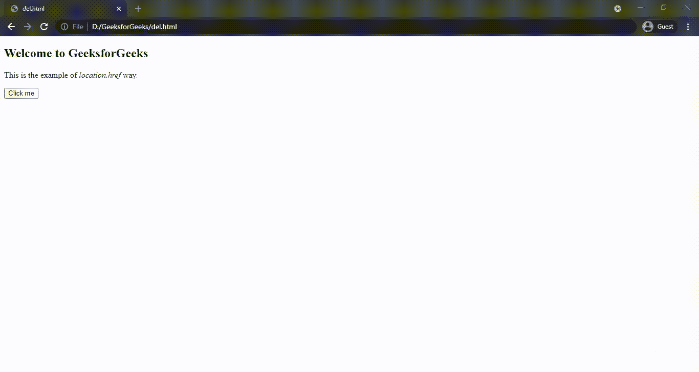
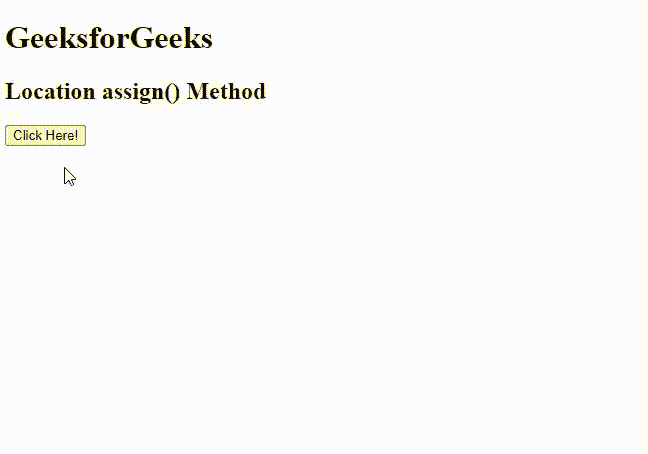

# 如何使用 JavaScript 重定向到另一个网页？

> 原文:[https://www . geesforgeks . org/如何使用 javascript 重定向到另一个网页/](https://www.geeksforgeeks.org/how-to-redirect-to-another-webpage-using-javascript/)

在本文中，我们将了解如何使用 Javascript 将网页重定向到另一个网页，并通过示例了解其实现。

有几种方法可以使用 JavaScript 重定向到另一个网页。其中一些列举如下:

*   [**location . href**](https://www.geeksforgeeks.org/html-dom-location-href-property/)**:用于设置或返回当前页面的完整网址。**
*   [**location . replace()**](https://www.geeksforgeeks.org/html-dom-location-replace-method/)**:用于将当前单据替换为指定的单据。**
*   [**location()**](https://www.geeksforgeeks.org/html-location-assign-method/)**:用于加载新文档。**

**语法:**

```
location.href="*URL*"
      or
location.replace("*URL*")
      or
location.assign("*URL*")
```

**参数:**接受单个参数**网址**，这是必需的。它用于指定新网页的引用。

**返回值:**无返回值。

**示例 1:** 该示例说明了 **location.href** 属性的使用。

## 超文本标记语言

```
<!DOCTYPE html>
<html>

<body>
    <h2>Welcome to GeeksforGeeks</h2>
    <p>This is the example of <i>location.href</i> way. </p>

    <button onclick="myFunc()">Click me</button>

    <!--script to redirect to another webpage-->
    <script>
    function myFunc() {
        window.location.href = "https://www.geeksforgeeks.org/";
    }
    </script>
</body>

</html>
```

**输出:**



location.href 属性

**示例 2:** 这是一个 **location.replace()** 方法的示例。

## 超文本标记语言

```
<!DOCTYPE html>
<html>

<body>
    <h2>Welcome to GeeksforGeeks</h2>
    <p>This is the example of <i>location.replace</i> method. </p>

    <button onclick="myFunc()">Click me</button>

    <!--script to redirect to another webpage-->
    <script>
    function myFunc() {
        location.replace("https://www.geeksforgeeks.org/");
    }
    </script>
</body>

</html>
```

**输出:**


位置.替换

**示例 3:** 本示例使用 **location.assign()** 方法。

## 超文本标记语言

```
<!DOCTYPE html>
<html>

<head>
    <title>Location assign() Method</title>
</head>

<body>
    <h1>GeeksforGeeks</h1>
    <h2>Location assign() Method</h2>
    <button onclick="load()">Click Here!</button>

    <!-- Script to use Location assign() Method -->
    <script>
    function load() {
        location.assign("https://ide.geeksforgeeks.org/index.php");
    }
    </script>
</body>

</html>
```

**输出:**



位置.分配

**注意:**所有方法的输出都是相同的，但是 *location.replace()* 方法从文档历史中删除当前文档的 URL。因此，如果您希望选项导航回原始文档，最好使用 *location.assign()* 方法。