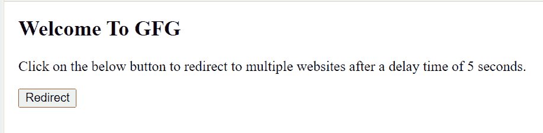

# 如何使用 JavaScript 延迟重定向到多个网站？

> 原文:[https://www . geeksforgeeks . org/如何使用 javascript 重定向到多个延迟网站/](https://www.geeksforgeeks.org/how-to-redirect-to-multiple-websites-with-a-delay-using-javascript/)

我们已经给了多个网站，任务是使用 JavaScript 重定向到多个网站，有一些延迟。我们将使用 **setTimeout()** 功能来延迟网站。

[**setTimeout()函数:**](https://www.geeksforgeeks.org/java-script-settimeout-setinterval-method/)**setTimeout()方法在等待指定的毫秒数后执行一个函数。**

**第一个参数是要执行的命令/功能，第二个参数表示执行前的延迟时间(毫秒)。**

**例如:**

## **java 描述语言**

```html
console.log("Geeks");
setTimeout(() => {  console.log("forGeeks"); }, 3000);
```

**这将把“极客”记录到控制台上，然后在三秒钟后“伪造”，在许多情况下，我们被要求执行某个任务，然后等待一段时间并继续执行另一个任务，因此在这些情况下，我们可以使用 setTimeout 方法。**

****以一定延迟重定向到多个网站:**给定各个网站的链接，任务是以一定延迟时间重定向到它们。让网站的网址为**

*   **https://www.geeksforgeeks.org/**
*   **https://write.geeksforgeeks.org/**
*   **https://auth.geeksforgeeks.org/user/sahivam4u/profile**
*   **https://github.com/shivam7374**

**经过 5 秒钟的延迟后，我们必须一个接一个地重定向到他们所有人。上述问题可以通过使用下面给出的代码来解决:**

## **超文本标记语言**

```html
<!DOCTYPE html>
<html>

<head>
    <script type="text/javascript">
        function Redirect() {
            const URLS = [
        'https://www.geeksforgeeks.org/',
        'https://write.geeksforgeeks.org/',
        'https://auth.geeksforgeeks.org/user/sahivam4u/profile',
        'https://github.com/shivam7374'
            ];

            for (let i = 0; i < URLS.length; i++) {
                setTimeout(() => {
                    const a = document.createElement('a');

                    a.style.display = 'none';
                    a.href = URLS[i];
                    a.target = '_blank';
                    document.body.appendChild(a);

                    a.click();
                    a.remove();
                }, i * 5000);
            }
        }
    </script>
</head>

<body>
    <h2>Welcome To GFG</h2>

<p>
        Click on the below button to 
        redirect to multiple websites
        after a delay time of 5 seconds.
    </p>

    <button onclick="Redirect();">
        Redirect
    </button>
</body>

</html>
```

****输出:****

**

**<u>点击重定向按钮，重定向到多个网站。</u>T3】**** 

**当我们运行上面给定的 HTML 代码并单击重定向按钮时，网站会在 5 秒钟的延迟时间后自动重定向到上面定义的多个网站。这个延迟时间和网站重定向到的网站可以通过改变 HTML 文件的脚本标签中的值来改变。在脚本标签中，我们正在为每个被点击的网站链接创建“a”(锚)标签，由于该标签，网站被重定向，并且锚标签在重定向后被删除，并且在延迟 5 秒后形成另一个标签，直到我们重定向到所有给定的多个网站链接。**