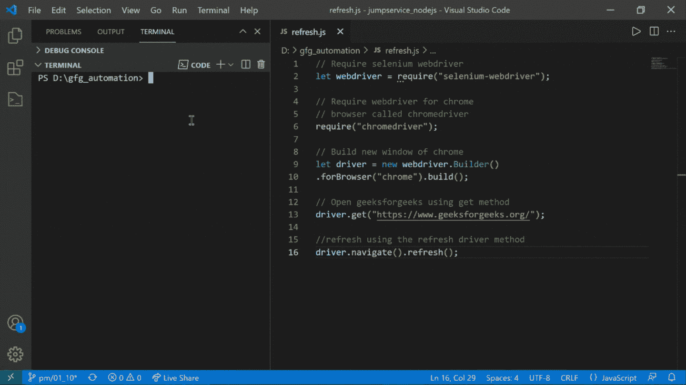

# 如何使用 selenium JavaScript 刷新页面？

> 原文:[https://www . geesforgeks . org/如何使用 selenium-javascript 刷新页面/](https://www.geeksforgeeks.org/how-to-refresh-a-page-using-selenium-javascript/)

[Selenium](https://www.geeksforgeeks.org/selenium-basics-components-features-uses-and-limitations/) 是一个工具借助它，我们可以在 web 浏览器中进行自动化测试。根据硒的官方文档，硒可以自动处理网络上的任何东西。Selenium 中的自动化脚本可以用多种编程语言编写，如 C#、JavaScript、Java、Python 和其他一些语言。在 web 自动化的过程中，可能会出现许多需要您刷新页面的情况，因此本文围绕如何使用 selenium JavaScript 自动刷新页面展开。

**语法:**

```
driver.navigate().refresh();
```

**示例:**

```
driver.get("https://www.geeksforgeeks.org/");
driver.navigate().refresh();
```

为了看看我们到底如何利用*刷新*驱动方法在 selenium javascript 中刷新网页，让我们看看下面的自动化场景。

**方法:**我们的任务是编写一个自动化脚本，打开 geeksforgeeks 的网页并刷新。为了执行相同的操作，我们必须遵循以下步骤:

*   创建一个网络驱动程序(这里是 chrome 浏览器的 chromedriver)。
*   使用 chromedriver 创建一个新的 chrome 窗口。
*   使用*获取*方法导航到 geeksforgeeks 网站。
*   使用*刷新*方法刷新页面。

下面是上述方法的实现:

## index.js

```
// Require selenium webdriver
let webdriver = require("selenium-webdriver");

// Require webdriver for chrome
// browser called chromedriver
require("chromedriver");

// Build a new window of chrome
let driver = new webdriver.Builder()
.forBrowser("chrome").build();

// Open geeksforgeeks using get method
driver.get("https://www.geeksforgeeks.org/");

//refresh using the refresh driver method
driver.navigate().refresh();
```

**运行上述代码的步骤:**打开终端，输入以下命令。

> 节点索引. js

**输出:**

