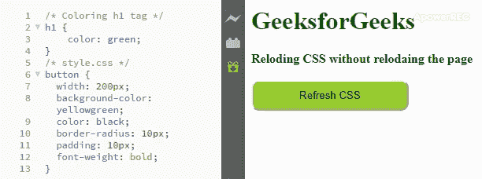

# 如何在不使用 JavaScript 重新加载页面的情况下重新加载 CSS？

> 原文:[https://www . geesforgeks . org/如何使用 javascript 重新加载 css 而不重新加载页面/](https://www.geeksforgeeks.org/how-to-reload-css-without-reloading-the-page-using-javascript/)

在使用 CSS 时，您可能会遇到这样的情况:您在样式表中做了一些更改，并且必须进行硬重新加载才能看到浏览器中反映的更改。或者风格取决于一些用户交互，你不希望每次都硬重新加载页面。有时候，你不想丢失使用开发工具所做的更改，只是希望重新加载 CSS。其他时候，CSS 被如此顽固地缓存，甚至刷新整个页面也没有帮助。今天我们将学习如何在不重新加载整个页面的情况下重新加载 CSS。

使用 JavaScript，我们可以在每次更新 CSS 时，在 CSS 文件路径中追加一个新的版本号作为查询参数。通过向 URL 添加不同的查询参数，浏览器将其作为唯一的 URL 进行处理，并单独缓存它，从而允许您加载更新的版本。您可以将此功能附加到每次单击都会重新加载 CSS 的按钮(或作为快捷键的键盘键组合)上。我们可以使用当前日期时间作为版本号，因为它将始终是一个新的唯一字符串。

*   **语法:**添加如下格式的创建的 CSS 文件。

    ```html
    <link rel="stylesheet" type="text/css" href="css/style.css?version=#">
    ```

*   **index.html 用 JavaScript 代码:**

    ```html
    <!DOCTYPE html>
    <html>

    <head>
      <link rel="stylesheet" type="text/css"
                href="style.css"/>
    </head>

    <body>
        <h1>GeeksforGeeks</h1>   
        <b>Reloding CSS without relodaing the page</b>
        <br><br>

        <button onclick="refreshCSS()">
            Refresh CSS
        </button>

        <script>
            refreshCSS = () => {
                let links = document.getElementsByTagName('link');
                for (let i = 0; i < links.length; i++) {
                    if (links[i].getAttribute('rel') == 'stylesheet') {
                        let href = links[i].getAttribute('href')
                                                .split('?')[0];

                        let newHref = href + '?version=' 
                                    + new Date().getMilliseconds();

                        links[i].setAttribute('href', newHref);
                    }
                }
            }
        </script>
    </body>

    </html>
    ```

    T4】
*   **CSS 文件样式:**

    ```html
    /* Coloring h1 tag */
    h1 {
        color: green;
    }
    /* Button styling */
    button {
      width: 200px;
      background-color: purple;
      color: black;
      border-radius: 10px;
      padding: 10px;
      font-weight: bold;
    }
    ```

*   **输出:**
    
*   你可以在你的浏览器中添加这个函数作为 JavaScript [书签](https://en.wikipedia.org/wiki/Bookmarklet)，它会在你每次点击它时重新加载 CSS。

    ```html
    javascript:(function(){
      let links = document.getElementsByTagName('link');
          for (let i = 0; i < links.length; i++) {
              if (links[i].getAttribute('rel') == 'stylesheet') {
            let href = links[i].getAttribute('href').split('?')[0];
                  let newHref = href + '?version=' 
                               + new Date().getMilliseconds();
                  console.log(newHref)
                  links[i].setAttribute('href', newHref);
              }
          }
    })();

    ```