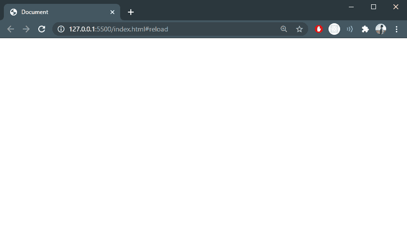

# 如何在 JavaScript 中只重载一次页面？

> 原文:[https://www . geeksforgeeks . org/如何重新加载页面-只需一次 javascript/](https://www.geeksforgeeks.org/how-to-reload-page-only-once-in-javascript/)

在本文中，我们将实现一个只允许我们重新加载一次页面的 JavaScript 代码。

最简单的实现:

```
window.location.reload()
```

这是 JavaScript 中最简单的将重新加载页面的内置方法，但任务是仅刷新页面/重新加载页面一次。

由于这个 JavaScript 方法反复重新加载页面&为了解决这个问题，我们将使用示例中解释的 [**位置哈希属性**](https://www.geeksforgeeks.org/html-dom-location-hash-property/) 。

**示例 1:** 本示例描述位置哈希属性。

*   哈希属性设置或返回 URL 的锚点部分，包括哈希/井号(#)。
*   使用此属性时，不要在哈希字符串中包含井号(#)。

## 超文本标记语言

```
<!DOCTYPE html>
<html lang="en">

<head>
  <meta charset="UTF-8" />
  <meta name="viewport" content=
    "width=device-width, initial-scale=1.0" />
  <title>Document</title>
</head>

<body>
  <script lang="javascript">
    const reloadUsingLocationHash = () => {
      window.location.hash = "reload";
    }
    window.onload = reloadUsingLocationHash();
  </script>
</body>

</html>
```

**输出:**网址由**http://127 . 0 . 0 . 1:5500/index . html**变为**http://127 . 0 . 0 . 1:5500/index . html # reload**



**示例 2:** 在此示例中，我们将执行相同的操作，但不使用 **location.hash** 属性&，也不更改/添加页面 URL 的 hash(#)符号。

我们要用 [**DOM 位置重载()**](https://www.geeksforgeeks.org/html-dom-location-reload-method/) 的方法来实现同样的。

## 超文本标记语言

```
<!DOCTYPE html>
<html lang="en">

<head>
    <meta charset="UTF-8" />
    <meta name="viewport" content=
        "width=device-width, initial-scale=1.0" />

    <script type='text/javascript'>

        // JavaScript anonymous function
        (() => {
            if (window.localStorage) {

                // If there is no item as 'reload'
                // in localstorage then create one &
                // reload the page
                if (!localStorage.getItem('reload')) {
                    localStorage['reload'] = true;
                    window.location.reload();
                } else {

                    // If there exists a 'reload' item
                    // then clear the 'reload' item in
                    // local storage
                    localStorage.removeItem('reload');
                }
            }
        })(); // Calling anonymous function here only
    </script>
</head>

<body></body>

</html>
```

**输出:**页面在不修改现有网址的情况下重新加载，这一切都是可能的，因为有了 HTML DOM 窗口本地存储。

