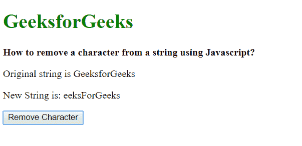
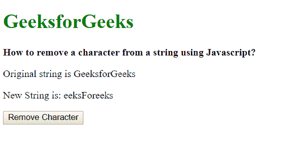
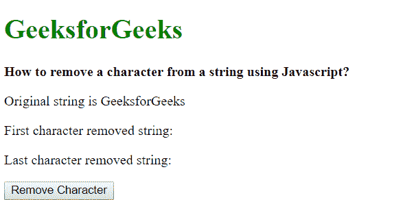
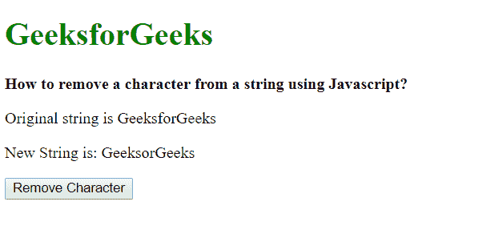

# 如何在 JavaScript 中删除字符串中的一个字符？

> 原文:[https://www . geesforgeks . org/如何从 javascript 字符串中删除字符/](https://www.geeksforgeeks.org/how-to-remove-a-character-from-string-in-javascript/)

给定一个字符串，任务是从给定的字符串中移除一个字符。

**方法 1:使用 [replace()方法](https://www.geeksforgeeks.org/javascript-string-replace/):**replace 方法用于将特定字符/字符串替换为其他字符/字符串。它需要两个参数，第一个是要替换的字符串，第二个是要替换的字符串。在这种情况下，第一个参数是要删除的字符，第二个参数可以作为空字符串给出。这将从字符串中删除该字符。此方法移除字符串的第一个匹配项。

**语法:**

```
string.replace('characterToReplace', '');
```

**示例:**

```
<!DOCTYPE html>
<html>

<head>
    <title>
        How to remove a character from 
        string using Javascript?
    </title>
</head>

<body>
    <h1 style="color: green">
        GeeksforGeeks
    </h1>

    <b>
        How to remove a character from
        a string using Javascript?
    </b>

    <p>Original string is GeeksforGeeks</p>

    <p>
        New String is: 
        <span class="output"></span>
    </p>

    <button onclick="removeCharacter()">
        Remove Character
    </button>

    <script type="text/javascript">
        function removeCharacter() {
            originalString = 'GeeksForGeeks';
            newString = originalString.replace('G', '');

            document.querySelector('.output').textContent 
                    = newString;
        }
    </script>
</body>

</html>                    
```

**输出:**

*   **点击按钮前:**
    
*   **点击按钮后:**
    

**方法 2:用正则表达式使用 replace()方法:**此方法用于移除指定字符的所有出现，与之前的方法不同。使用正则表达式代替字符串和全局属性。它将选择字符串中的每个匹配项，并且可以删除。

**语法:**

```
string.replace(/regExp/g, '');
```

**示例:**

```
<!DOCTYPE html>
<html>

<head>
    <title>
        How to remove a character from 
        string using Javascript?
    </title>
</head>

<body>
    <h1 style="color: green">
        GeeksforGeeks
    </h1>

    <b>
        How to remove a character from
        a string using Javascript?
    </b>

    <p>Original string is GeeksforGeeks</p>

    <p>
        New String is: 
        <span class="output"></span>
    </p>

    <button onclick="removeCharacter()">
        Remove Character
    </button>

    <script type="text/javascript">
        function removeCharacter() {
            originalString = 'GeeksForGeeks';
            newString = originalString.replace(/G/g, '');

            document.querySelector('.output').textContent
                    = newString;
        }
    </script>
</body>

</html>                    
```

**输出:**

*   **点击按钮前:**
    
*   **点击按钮后:**
    

**方法 3:使用 slice()方法移除第一个或最后一个字符:**slice()方法用于提取给定参数之间的字符串部分。此方法获取字符串的起始索引和结束索引，并返回这些索引之间的字符串。如果未指定结束索引，则假定它是字符串的长度。通过将起始索引指定为 1，可以删除第一个字符。它提取从第二个字符到字符串末尾的字符串。通过将结束索引指定为比字符串长度少一个字符，可以删除最后一个字符。这将提取从字符串开头到倒数第二个字符的字符串。

**语法:**

```
// Removing the first character
string.splice(1);

// Removing the last character
string.splice(0, string.length - 1);

```

**示例:**

```
<!DOCTYPE html>
<html>

<head>
    <title>
        How to remove a character from 
        string using Javascript?
    </title>
</head>

<body>
    <h1 style="color: green">
        GeeksforGeeks
    </h1>

    <b>
        How to remove a character from
        a string using Javascript?
    </b>

    <p>Original string is GeeksforGeeks</p>

    <p>
        First character removed string: 
        <span class="output1"></span>
    </p>

    <p>
        Last character removed string: 
        <span class="output2"></span>
    </p>

    <button onclick="removeCharacter()">
        Remove Character
    </button>

    <script type="text/javascript">
        function removeCharacter() {
            originalString = 'GeeksForGeeks';
            firstCharRemoved = originalString.slice(1);

            lastCharRemoved = 
                originalString.slice(0, originalString.length - 1);

            document.querySelector('.output1').textContent
                    = firstCharRemoved;
            document.querySelector('.output2').textContent
                    = lastCharRemoved;
        }
    </script>
</body>

</html>                    
```

**输出:**

*   **点击按钮前:**
    
*   **点击按钮后:**
    

**方法 4:使用 substr()移除给定索引处的特定字符方法:**此方法可用于从字符串中的特定索引处移除字符。substr()方法用于提取给定参数之间的字符串部分。此方法采用两个参数，一个是字符串的起始索引，另一个是字符串的结束索引。返回这些索引之间的字符串。字符串中要删除的字符前后的部分被分开并连接在一起。这将从特定索引中移除字符。

**语法:**

```
string.slice(0, position - 1) + string.slice(position, string.length);
```

**示例:**

```
<!DOCTYPE html>
<html>

<head>
    <title>
        How to remove a character from 
        string using Javascript?
    </title>
</head>

<body>
    <h1 style="color: green">
        GeeksforGeeks
    </h1>

    <b>
        How to remove a character from
        a string using Javascript?
    </b>

    <p>Original string is GeeksforGeeks</p>

    <p>
        New String is: 
        <span class="output"></span>
    </p>

    <!-- Removing the 6th character -->
    <button onclick="removeCharacter(6)">
        Remove Character
    </button>

    <script type="text/javascript">
        function removeCharacter(position) {
            originalString = 'GeeksForGeeks';

            newString = originalString.slice(0, position - 1)
            + originalString.slice(position, originalString.length);

            document.querySelector('.output').textContent = newString;
        }
    </script>
</body>

</html>                    
```

**输出:**

*   **点击按钮前:**
    
*   **点击按钮后:**
    

JavaScript 最出名的是网页开发，但它也用于各种非浏览器环境。您可以通过以下 [JavaScript 教程](https://www.geeksforgeeks.org/javascript-tutorial/)和 [JavaScript 示例](https://www.geeksforgeeks.org/javascript-examples/)从头开始学习 JavaScript。