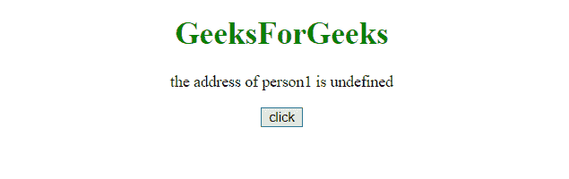

# 如何从 JavaScript 对象中移除一个属性？

> 原文:[https://www . geesforgeks . org/如何从 javascript 对象中移除属性/](https://www.geeksforgeeks.org/how-to-remove-a-property-from-javascript-object/)

**delete** 关键字用于删除 **javaScript** 中对象的属性。
**语法:**

```
delete object.property or
delete object[property]

```

**注:**

*   Delete 关键字同时删除属性和属性的值。删除后，该属性不能使用。
*   Delete 运算符设计用于对象属性。它不能用于变量或函数。
*   删除运算符不应用于预定义的 JavaScript 对象属性。它会引起问题。

**示例 1:** 本示例删除对象的地址属性。

```
<!DOCTYPE html>  
<html>  
    <head> 
        <title></title>
    </head> 

    <body style = "text-align:center;">  
        <h1 style = "color:green;" >  
            GeeksForGeeks  
        </h1>
        <p id="demo">the address of person1 is address1</p> 

        <button onClick="fun()">click
        </button>

        <script>
        function fun(){
          let p = {
            name: "person1",
            age:50,
            address:"address1"
          };
           delete p.address;
           document.getElementById("demo").innerHTML =
           "the address of "+ p.name +" is " + p.address;         
          }
        </script> 
    </body>  
</html>
```

**输出:**

*   **点击按钮前:**
    
*   **点击按钮后:**
    
    **Example 2:** 

    ```
    <!DOCTYPE html>  
    <html>  
        <head> 
            <title></title>
        </head> 

        <body style = "text-align:center;">  

            <h1 style = "color:green;" >  
                GeeksForGeeks  
            </h1>
            <p id="demo">person1 is 50 years old.</p> 

            <button onClick="fun()">click
            </button>

            <script>
            function fun(){
              let p = {
                name: "person1",
                age:50,
                address:"address1"
              };

              delete p.age;
              document.getElementById("demo").innerHTML =
              p.name + " is " + p.age + " years old. ";
    }
            </script> 
        </body>  
    </html>
    ```

    **输出:**

    *   **点击按钮前:**
        
    *   **点击按钮后:**
        