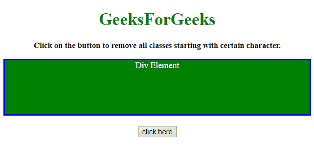
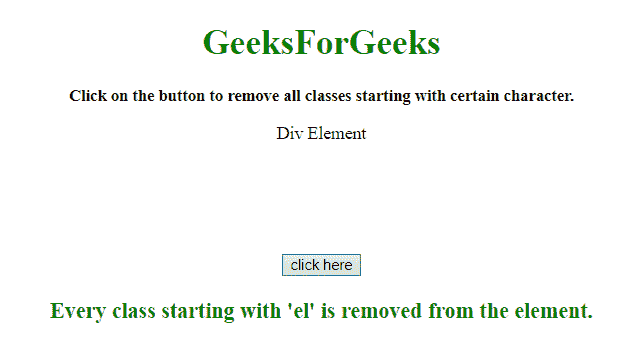

# 如何删除 JavaScript 中所有以某个字符串开头的类？

> 原文:[https://www . geeksforgeeks . org/如何移除以 javascript 中的某个字符串开头的所有类/](https://www.geeksforgeeks.org/how-to-remove-all-classes-that-begin-with-a-certain-string-in-javascript/)

任务是从一个特定的前缀开始移除某个元素的所有类。这里讨论了一些最常用的技术。我们将使用 JavaScript。

**方法 1:**

*   选择特定元素。
*   使用**。类名属性**可以访问所有的类。
*   使用**。replace()方法**用空格替换所有特定的类(这意味着类从元素中移除)。
*   在本例中，正则表达式用于替换。

**示例 1:** 该示例使用上述方法。

```
<!DOCTYPE HTML>
<html>

<head>
    <title>
        How to remove all classes that
      begin with a certain string JavaScript?
    </title>
    <script src=
"https://ajax.googleapis.com/ajax/libs/jquery/3.4.1/jquery.min.js">
    </script>
    <style>
        #div {
            height: 100px;
        }

        .el-color {
            color: white;
        }

        .el-background {
            background: green;
        }

        .el-border {
            border: 3px solid blue;
        }
    </style>

</head>

<body id="body" align="center">
    <h1 style="color:green;">  
            GeeksForGeeks  
        </h1>
    <p id="GFG_UP" 
       style="font-size: 15px; 
              font-weight: bold;">
    </p>
    <div id="div"
         class="el-color el-background el-border">
        Div Element
    </div>
    <br>
    <button onclick="GFG_Fun()">
        click here
    </button>
    <p id="GFG_DOWN" 
       style="font-size: 20px;
              font-weight: bold;
              color:green;">
    </p>
    <script>
        var el_up = document.getElementById('GFG_UP');
        var el_down = document.getElementById('GFG_DOWN');
        el_up.innerHTML = 
          "Click on the button to remove all "+
          "classes starting with certain character.";

        function GFG_Fun() {
            $('#div')[0].className = 
              $('#div')[0].className.replace(/\bel.*?\b/g, '');
            el_down.innerHTML = 
              "Every class starting with 'el' is removed from the element.";
        }
    </script>
</body>

</html>
```

**输出:**

*   **点击按钮前:**
    
*   **点击按钮后:**
    

**接近 2**

*   选择特定元素。
*   使用**。类名属性**获取对所有类的访问。
*   使用**。split()方法**获取所有类作为一个元素。
*   使用**。filter()函数**过滤掉不以某个字符开头的类。
*   最后，将这些类与元素放在一起。

**示例 2:** 该示例使用上述方法。

```
<!DOCTYPE HTML>
<html>

<head>
    <title>
        How to remove all classes that 
      begin with a certain string JavaScript?
    </title>
    <script src=
"https://ajax.googleapis.com/ajax/libs/jquery/3.4.1/jquery.min.js">
    </script>
    <style>
        #div {
            height: 100px;
        }

        .el-color {
            color: white;
        }

        .el-background {
            background: green;
        }

        .el-border {
            border: 3px solid blue;
        }
    </style>

</head>

<body id="body" align="center">
    <h1 style="color:green;">  
            GeeksForGeeks  
        </h1>
    <p id="GFG_UP" 
       style="font-size: 15px; 
              font-weight: bold;">
    </p>
    <div id="div" 
         class="el-color el-background el-border">
        Div Element
    </div>
    <br>
    <button onclick="GFG_Fun()">
        click here
    </button>
    <p id="GFG_DOWN" 
       style="font-size: 20px; 
              font-weight: bold;
              color:green;">
    </p>
    <script>
        var el_up = document.getElementById('GFG_UP');
        var el_down = document.getElementById('GFG_DOWN');
        var el = document.getElementById('div');
        el_up.innerHTML = "Click on the button to remove "+
          "all classes starting with certain character.";

        function GFG_Fun() {
            var startsWith = "el";
            var classes = el.className.split(" ").filter(function(v) {
                return v.lastIndexOf(startsWith, 0) !== 0;
            });
            el.className = classes.join(" ").trim();
            el_down.innerHTML = 
              "Every class starting with 'el' is removed from the element.";
        }
    </script>
</body>

</html>
```

**输出:**

*   **点击按钮前:**
    
*   **点击按钮后:**
    