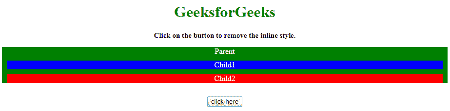

# 如何使用 JavaScript/jQuery 移除所有内联样式？

> 原文:[https://www . geesforgeks . org/how-to-remove-all-inline-style-use-JavaScript-jquery/](https://www.geeksforgeeks.org/how-to-remove-all-inline-styles-using-javascript-jquery/)

给定一个包含内联和内部 CSS 的 HTML 文档，任务是在 JavaScript 的帮助下从特定元素中移除内联 CSS 样式。

**方法:**使用 **jQuery [attr()](https://www.geeksforgeeks.org/jquery-attr-method/) 和 [removeAttr()](https://www.geeksforgeeks.org/jquery-removeattr-with-examples/)** 方法移除内联样式属性。attr()方法将属性值设置为空(")。

**示例 1:** 本示例使用 **attr()方法**移除内嵌样式。

```
<!DOCTYPE HTML>
<html>

<head>
    <title>
        How to remove all inline styles
        using JavaScript/jQuery ?
    </title>

    <script src=
"https://ajax.googleapis.com/ajax/libs/jquery/3.4.1/jquery.min.js">
    </script>

    <style>
        .parent {
            background: green;
        }
        .child1 {
            background: blue;
            margin: 10px;
        }
        .child2 {
            background: red;
            margin: 10px;
        }
    </style>
</head>

<body style="text-align:center;">

    <h1 style="color:green;"> 
        GeeksforGeeks 
    </h1>

    <p id="GFG_UP" style=
        "font-size: 15px; font-weight: bold;">
    </p>

    <div class="parent" id="parent" style="color:white">
        Parent
        <div class="child child1">
            Child1
        </div>
        <div class="child child2">
            Child2
        </div>
    </div>
    <br>

    <button onclick="GFG_Fun()">
        click here
    </button>

    <p id="GFG_DOWN" style=
        "font-size: 24px; font-weight: bold; color: green;">
    </p>

    <script>
        var up = document.getElementById('GFG_UP');
        var down = document.getElementById('GFG_DOWN');
        var parent = document.getElementById('parent');

        up.innerHTML = "Click on the button to remove"
                            + " the inline style.";

        function GFG_Fun() {
            $('#parent').attr('style', '');
            down.innerHTML = "Inline style has been removed.";
        }
    </script>
</body>

</html>
```

**输出:**

*   **点击按钮前:**
    
*   **点击按钮后:**
    

**示例 2:** 使用 **jQuery [removeAttr()方法](https://www.geeksforgeeks.org/jquery-removeattr-with-examples/)** 移除内联样式属性。removeAttr()方法移除样式属性值。

```
<!DOCTYPE HTML>
<html>

<head>
    <title>
        How to remove all inline styles
        using JavaScript/jQuery ?
    </title>

    <script src=
"https://ajax.googleapis.com/ajax/libs/jquery/3.4.1/jquery.min.js">
    </script>

    <style>
        .parent {
            background: green;
        }
        .child1 {
            background: blue;
            margin: 10px;
        }
        .child2 {
            background: red;
            margin: 10px;
        }
    </style>
</head>

<body style="text-align:center;">

    <h1 style="color:green;"> 
        GeeksforGeeks 
    </h1>

    <p id="GFG_UP" style=
        "font-size: 15px; font-weight: bold;">
    </p>

    <div class="parent" id="parent" style="color:white">
        Parent
        <div class="child child1">
            Child1
        </div>
        <div class="child child2">
            Child2
        </div>
    </div>
    <br>

    <button onclick="GFG_Fun()">
        click here
    </button>

    <p id="GFG_DOWN" style=
        "font-size: 24px; font-weight: bold; color: green;">
    </p>

    <script>
        var up = document.getElementById('GFG_UP');
        var down = document.getElementById('GFG_DOWN');
        var parent = document.getElementById('parent');

        up.innerHTML = "Click on the button to remove "
                        + "the inline style.";

        function GFG_Fun() {
            $('#parent').removeAttr('style');
            down.innerHTML = "Inline style has been removed.";
        }
    </script>
</body>

</html>
```

**输出:**

*   **点击按钮前:**
    
*   **点击按钮后:**
    