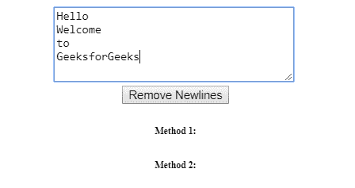
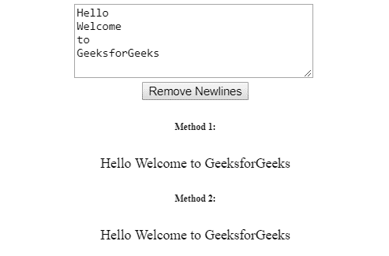

# 如何用 JavaScript 删除字符串中的所有换行符？

> 原文:[https://www . geesforgeks . org/如何使用 javascript 从字符串中删除所有换行符/](https://www.geeksforgeeks.org/how-to-remove-all-line-breaks-from-a-string-using-javascript/)

字符串中的换行符因平台而异，但最常见的有以下几种:

*   **窗口:** \r\n 回车后跟换行符。
*   **Linux:** \n 只是一个换行符。
*   **老 Macs:** \r 只是一个回车符。

有两种方法可以完成这项任务。方法之一是使用传统的编程循环，一次访问一个字符。另一个是使用正则表达式。

**切片缝合法:**是实现解决这个问题的基本途径。访问字符串中的每个字符，并以删除换行符和回车符的方式对它们进行切分。

**代码片段:**

```
var newstr = "";
for( var i = 0; i < str.length; i++ ) 
    if( !(str[i] == '\n' || str[i] == '\r') )
        newstr += str[i];
```

所有这些代码片段只是将所有不是“换行符”或“回车符”的字符复制到另一个变量中。然而，这个解决方案有很多开销，因此不是删除换行符的最佳方式。

**正则表达式:**该方法使用正则表达式检测和替换字符串中的换行符。它和要替换的字符串一起被送入**替换**函数，在我们的例子中是一个空字符串。

```
String.replace( *regex / substr*, *replace with* )
```

覆盖所有类型换行符的正则表达式是

```
/\r\n|\n|\r/gm
```

可以看到，这个正则表达式已经覆盖了所有由 **|** 运算符分隔的情况。这可以简化为

```
/[\r\n]+/gm
```

其中 **g** 和 **m** 代表全局和多行标志。

**代码片段:**

```
function remove_linebreaks( var str ) {
    return str.replace( /[\r\n]+/gm, "" );
}
```

最棒的是，这种方法的性能几乎是前一种方法的 10 倍。

**示例:**

```
<!DOCTYPE html>
<html>

<head>
    <title>
        Remove all line breaks from
        a string using JavaScript
    </title>

    <script>
    // Method 1

    // Slice and Stitch
    function remove_linebreaks_ss( str ) {
        var newstr = "";

        for( var i = 0; i < str.length; i++ ) 
            if( !(str[i] == '\n' || str[i] == '\r') )
                    newstr += str[i];

        return newstr;
    } 

    // Method 2

    // Regular Expression
    function remove_linebreaks( str ) {
        return str.replace( /[\r\n]+/gm, "" );
    }

    function removeNewLines() {
        var sample_str =
            document.getElementById('raw-text').value;

        console.time(); 

        // For printing time taken on console.
        document.getElementById('res-1').innerHTML
                = remove_linebreaks_ss( sample_str );
        console.timeEnd();

        console.time();
        document.getElementById('res-2').innerHTML
                = remove_linebreaks( sample_str);
        console.timeEnd();
    }
    </script>
</head>

<body>
    <center>
        <textarea id="raw-text"></textarea>
        <br>

        <button onclick="removeNewLines()">
            Remove Newlines
        </button>

        <h6>Method 1:</h6>
        <p id='res-1'></p>

        <h6>Method 2:</h6>
        <p id='res-2'></p>
    </center>
</body>

</html>                
```

**输出:**

*   **点击按钮前:**
    
*   **点击按钮后:**
    