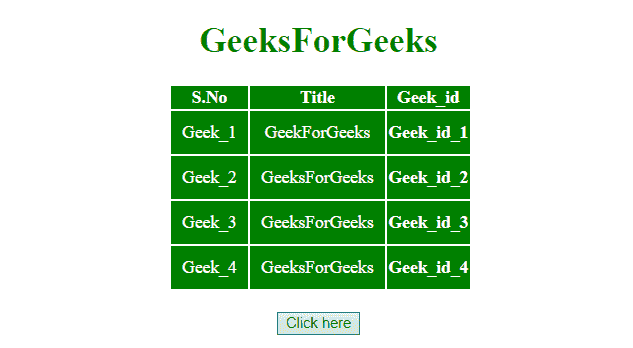
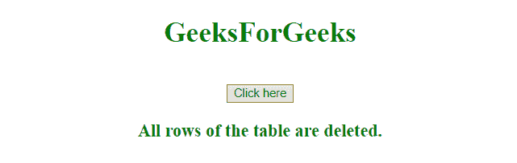

# 如何在 JavaScript 中删除一个表中的所有行？

> 原文:[https://www . geeksforgeeks . org/如何从 javascript 表格中删除所有行/](https://www.geeksforgeeks.org/how-to-remove-all-rows-from-a-table-in-javascript/)

给定一个包含一个 HTML 表的 HTML 文档，任务是从 HTML 表中移除所有行。删除所有行不同于删除少数几行。这可以通过使用 JavaScript 来完成。

**接近**

*   首先给表设置 ID 或唯一类。
*   选择表格元素，使用**移除()**或**分离()**方法删除所有表格行。

**示例 1:** 在本例中，使用 **remove()方法**删除所有行。

```
<!DOCTYPE HTML>
<html>

<head>
    <title>
        How to remove all rows from
        a table in JavaScript ?
    </title>

    <script src=
"https://ajax.googleapis.com/ajax/libs/jquery/3.4.0/jquery.min.js">
    </script>

    <style>
        #myCol {
            background: green;
        }
        table {
            color: white;
            margin-left: 150px;
        }
        #Geek_p {
            color: green;
            font-size: 30px;
        }
        td {
            padding: 10px;
        }
    </style>
</head>

<body style="text-align:center;">

    <h1 style="color:green;"> 
        GeeksForGeeks 
    </h1>

    <table id="table">
        <colgroup>
            <col id="myCol" span="2">
            <col style="background-color:green">
        </colgroup>

        <tr>
            <th>S.No</th>
            <th>Title</th>
            <th>Geek_id</th>
        </tr>
        <tr id="row1">
            <td>Geek_1</td>
            <td>GeekForGeeks</td>
            <th>Geek_id_1</th>
        </tr>
        <tr>
            <td>Geek_2</td>
            <td>GeeksForGeeks</td>
            <th>Geek_id_2</th>
        </tr>
        <tr>
            <td>Geek_3</td>
            <td>GeeksForGeeks</td>
            <th>Geek_id_3</th>
        </tr>
        <tr>
            <td>Geek_4</td>
            <td>GeeksForGeeks</td>
            <th>Geek_id_4</th>
        </tr>
    </table>
    <br>

    <button onclick="Geeks()">
        Click here
    </button>

    <p id="GFG_DOWN" style="
        color:green; font-size: 20px; font-weight: bold;">
    </p>

    <script>
        function Geeks() {
            $("#table").remove();
            $("#GFG_DOWN").text
                ("All rows of the table are deleted.");
        }
    </script>
</body>

</html>
```

**输出:**

*   **点击按钮前:**
    
*   **点击按钮后:**
    

**示例 2:** 在本例中，使用**分离()方法**删除所有行。

```
<!DOCTYPE HTML>
<html>

<head>
    <title>
        How to remove all rows from
        a table in JavaScript ?
    </title>

    <script src=
"https://ajax.googleapis.com/ajax/libs/jquery/3.4.0/jquery.min.js">
    </script>

    <style>
        #myCol {
            background: green;
        }

        table {
            color: white;
            margin-left: 150px;
        }

        #Geek_p {
            color: green;
            font-size: 30px;
        }

        td {
            padding: 10px;
        }
    </style>
</head>

<body style="text-align:center;">

    <h1 style="color:green;"> 
        GeeksForGeeks 
    </h1>

    <table id="table">
        <colgroup>
            <col id="myCol" span="2">
            <col style="background-color:green">
        </colgroup>

        <tr id="thead">
            <th>S.No</th>
            <th>Title</th>
            <th>Geek_id</th>
        </tr>
        <tr id="row1">
            <td>Geek_1</td>
            <td>GeekForGeeks</td>
            <th>Geek_id_1</th>
        </tr>
        <tr>
            <td>Geek_2</td>
            <td>GeeksForGeeks</td>
            <th>Geek_id_2</th>
        </tr>
        <tr>
            <td>Geek_3</td>
            <td>GeeksForGeeks</td>
            <th>Geek_id_3</th>
        </tr>
        <tr>
            <td>Geek_4</td>
            <td>GeeksForGeeks</td>
            <th>Geek_id_4</th>
        </tr>
    </table>
    <br>

    <button onclick="Geeks()">
        Click here
    </button>

    <p id="GFG_DOWN" style=
        "color:green; font-size: 20px; font-weight: bold;">
    </p>

    <script>
        function Geeks() {
            $('#table').detach();
            $("#GFG_DOWN").text
                ("All rows of the table are deleted.");
        }
    </script>
</body>

</html>
```

**输出:**

*   **点击按钮前:**
    
*   **点击按钮后:**
    