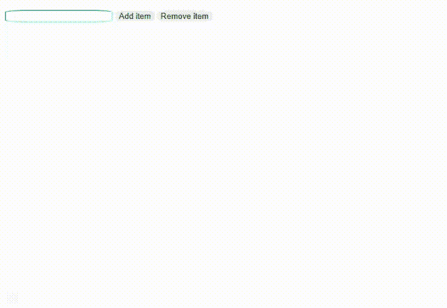

# 如何使用 JavaScript 移除添加的列表项？

> 原文:[https://www . geesforgeks . org/如何使用 javascript 删除添加的列表项/](https://www.geeksforgeeks.org/how-to-remove-an-added-list-items-using-javascript/)

在下面的文章中，我们使用 JavaScript 动态添加和移除列表项。我们使用 JavaScript 动态添加和/或删除列表项，这意味着如果我们运行我们的网页，它将显示使用按钮添加和删除项目的选项。

**方法:**在网页中，给用户条目一个输入文本框，用于添加列表项。提供了两个按钮来添加列表项和删除列表项。使用 JavaScript 函数 *addItem()* 和 *removeItem()添加或删除列表项。*列表项使用 *document.createElement()* 方法创建，要创建文本节点，使用*document . createtextnode()*方法，然后使用 *appendChild()* 方法追加该节点。使用 *removeChild(* )方法删除列表项。

下面列出了使用的内置功能。

*   **创建新元素:**我们可以使用*<u>document . createelement()</u>*功能创建新元素。它将动态创建元素。
*   **追加元素:**我们可以使用函数 *<u>追加元素()。</u>*
*   **创建文本节点:**我们可以使用*<u>document . createtextnode()</u>*元素创建文本节点。HTML 由元素节点和文本节点组成。所以 *createTextNode()* 方法用指定的文本创建一个文本节点。
*   **移除现有元素:**我们可以使用 *<u>移除子元素()</u>* 功能从创建的列表中移除子元素。

**示例:**下面的代码演示了使用 JavaScript 函数添加和删除列表项。

## 超文本标记语言

```html
<!DOCTYPE html>
<html lang="en">

<head>

    <style>
        #candidate {
            border-radius: 20%;
            border-color: aquamarine;
            box-sizing: border-box;
        }

        .buttonClass {
            border-radius: 20%;
            border-color: aqua;
            border-style: inherit;
        }

        button:hover {
            background-color: green;
        }
    </style>
</head>

<body>
    <ul id="list"></ul>

    <input type="text" id="candidate" />
    <button onclick="addItem()" class="buttonClass">
    Add item</button>
    <button onclick="removeItem()" class="buttonClass">
    Remove item</button>

    <script>
        function addItem() {
            var a = document.getElementById("list");
            var candidate = document.getElementById("candidate");
            var li = document.createElement("li");
            li.setAttribute('id', candidate.value);
            li.appendChild(document.createTextNode(candidate.value));
            a.appendChild(li);
        }

        // Creating a function to remove item from list
        function removeItem() {

            // Declaring a variable to get select element
            var a = document.getElementById("list");
            var candidate = document.getElementById("candidate");
            var item = document.getElementById(candidate.value);
            a.removeChild(item);
        }
    </script>
</body>

</html>
```

**输出:**现在，点击添加项目向列表中添加任何项目。单击删除项目从列表中删除任何项目。

