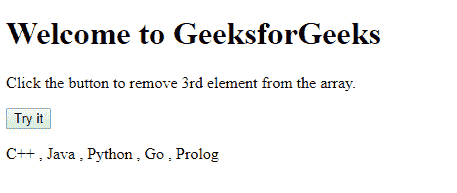
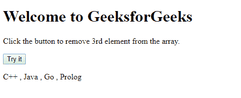

# 如何在 JavaScript 中移除数组中的元素？

> 原文:[https://www . geesforgeks . org/如何从 javascript 数组中移除元素/](https://www.geeksforgeeks.org/how-to-remove-an-element-from-an-array-in-javascript/)

Array **splice()** 方法可用于在 JavaScript 中移除数组中的任何特定元素。此外，该函数可用于从数组中添加/移除多个元素。

**语法:**

```
array.splice(index, howmany, item1, ....., itemX)
```

**参数:**该方法需要 3 个参数:-

*   **指数:**T2】必选。它指定移除/添加元素的位置。
*   **多少:** *可选*。它指定要移除多少元素。
*   **项:** *选*。它指定要添加的新元素。

**返回值:**一个新的数组，包含移除的项目(如果有)。

**示例:**本示例使用 splice()方法从数组中移除特定元素。

```
<!DOCTYPE html>
<html>
    <body>
        <h1>Welcome to GeeksforGeeks</h1>
        <p>Click the button to remove 3rd element from the array.</p>
        <button onclick="remove_ele()">Try it</button>
        <p id="display"></p>
        <p id="demo"></p>

        <!--Script to remove an element from an 
            array using spice method-->
        <script>
            var Lang = ["C++ ", " Java ", " Python ", " Go ", " Prolog"];
             document.getElementById("display").innerHTML = Lang;
             function remove_ele() {
               Lang.splice(2, 1);
               document.getElementById("display").innerHTML = Lang;
             }
        </script>
    </body>
</html>
```

**输出:**
**点击试听按钮前:**

**点击试听按钮后:**

**支持的浏览器:**数组拼接()方法支持的浏览器如下:

*   谷歌 Chrome
*   苹果 Safari
*   火狐浏览器
*   歌剧
*   边缘