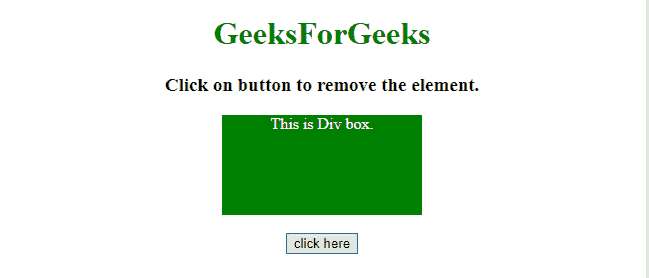
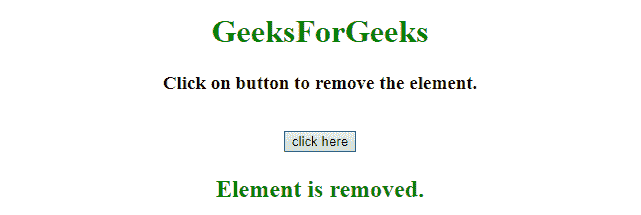

# 如何用 JavaScript 移除一个 HTML 元素？

> 原文:[https://www . geesforgeks . org/如何使用 javascript 移除 html 元素/](https://www.geeksforgeeks.org/how-to-remove-an-html-element-using-javascript/)

给定一个 HTML 元素，任务是使用 JavaScript 从文档中移除该元素。

**进场:**

*   选择需要移除的 HTML 元素。
*   使用 JavaScript **remove()** 和 **removeChild()方法**从 HTML 文档中移除元素。

**示例 1:** 本示例使用 removeChild()方法移除 HTML 元素。

```
<!DOCTYPE HTML> 
<html> 
    <head> 
        <title> 
            How to remove an HTML element
            using JavaScript ?
        </title>

        <style>
            #GFG_DIV {
                background: green;
                height: 100px;
                width: 200px;
                margin: 0 auto;
                color: white;
            }
        </style>
    </head> 

    <body style = "text-align:center;"> 

        <h1 style = "color:green;" > 
            GeeksForGeeks 
        </h1>

        <p id = "GFG_UP" style =
            "font-size: 19px; font-weight: bold;">
        </p>

        <div id = "GFG_DIV">
            This is Div box.
        </div>
        <br>

        <button onClick = "GFG_Fun()">
            click here
        </button>

        <p id = "GFG_DOWN" style =
            "color: green; font-size: 24px; font-weight: bold;">
        </p>

        <!-- Script to remove HTML element -->
        <script>
            var up = document.getElementById('GFG_UP');
            var down = document.getElementById('GFG_DOWN');
            var div = document.getElementById('GFG_DIV');
            up.innerHTML = "Click on button to remove the element.";

            function GFG_Fun() {
                div.parentNode.removeChild(div);
                down.innerHTML = "Element is removed."; 
            }
        </script> 
    </body> 
</html>                    
```

**输出:**

*   **点击按钮前:**
    
*   **点击按钮后:**
    

**示例 2:** 本示例使用 remove()方法从文档中移除一个 HTML 元素。

```
<!DOCTYPE HTML> 
<html> 
    <head> 
        <title> 
            How to remove an HTML element
            using JavaScript ?
        </title>

        <style>
            #GFG_DIV {
                background: green;
                height: 100px;
                width: 200px;
                margin: 0 auto;
                color: white;
            }
        </style>
    </head> 

    <body style = "text-align:center;"> 

        <h1 style = "color:green;" > 
            GeeksForGeeks 
        </h1>

        <p id = "GFG_UP" style =
            "font-size: 19px; font-weight: bold;">
        </p>

        <div id = "GFG_DIV">
            This is Div box.
        </div>
        <br>

        <button onClick = "GFG_Fun()">
            click here
        </button>

        <p id = "GFG_DOWN" style =
            "color: green; font-size: 24px; font-weight: bold;">
        </p>

        <!-- Script to remove HTML element -->
        <script>
            var up = document.getElementById('GFG_UP');
            var down = document.getElementById('GFG_DOWN');
            var div = document.getElementById('GFG_DIV');
            up.innerHTML = "Click on button to remove the element.";

            function GFG_Fun() {
                div.remove();
                down.innerHTML = "Element is removed."; 
            }
        </script> 
    </body> 
</html>                    
```

**输出:**

*   **点击按钮前:**
    
*   **点击按钮后:**
    

JavaScript 最出名的是网页开发，但它也用于各种非浏览器环境。您可以通过以下 [JavaScript 教程](https://www.geeksforgeeks.org/javascript-tutorial/)和 [JavaScript 示例](https://www.geeksforgeeks.org/javascript-examples/)从头开始学习 JavaScript。