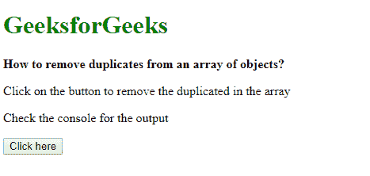
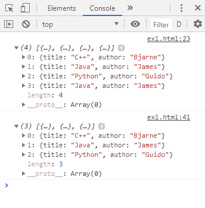

# 如何使用 JavaScript 从对象数组中移除重复项？

> 原文:[https://www . geesforgeks . org/如何使用 javascript 从对象数组中移除重复项/](https://www.geeksforgeeks.org/how-to-remove-duplicates-from-an-array-of-objects-using-javascript/)

给定一个对象数组，任务是从数组列表中移除重复的对象元素。有两种方法可以解决这个问题，讨论如下:

**方法 1:使用其中一个键作为索引:**创建一个临时数组，该数组使用其一个键作为索引来存储原始数组的对象。任何对象属性都可以用作密钥。密钥从对象中提取，并用作新临时数组的索引。然后将对象分配给该索引。这种方法将删除重复的对象，因为原始数组的每个对象中只有一个被分配给同一个索引。

**示例:**

```
<!DOCTYPE html>
<html>

<head>
    <title>
        How to remove duplicates from an
        array of objects using JavaScript ?
    </title>
</head>

<body>
    <h1 style="color: green">
        GeeksforGeeks
    </h1>

    <b>
        How to remove duplicates from
        an array of objects?
    </b>

    <p>
        Click on the button to remove 
        the duplicated in the array
    </p>

    <p>Check the console for the output</p>

    <button onclick="removeDuplicates()">
        Click here
    </button>

    <script type="text/javascript">

        function removeDuplicates() {

            // Create an array of objects
            books = [
                { title: "C++", author: "Bjarne" },
                { title: "Java", author: "James" },
                { title: "Python", author: "Guido" },
                { title: "Java", author: "James" },
            ];

            // Display the list of array objects
            console.log(books);

            // Declare a new array
            let newArray = [];

            // Declare an empty object
            let uniqueObject = {};

            // Loop for the array elements
            for (let i in books) {

                // Extract the title
                objTitle = books[i]['title'];

                // Use the title as the index
                uniqueObject[objTitle] = books[i];
            }

            // Loop to push unique object into array
            for (i in uniqueObject) {
                newArray.push(uniqueObject[i]);
            }

            // Display the unique objects
            console.log(newArray);
        }
    </script>
</body>

</html>
```

**输出:**

*   **点击按钮前:**
    
*   **点击按钮后:**
    

**方法 2:将数组转换为集合以移除重复项:**集合对象只保存任何类型的唯一值。此属性可用于仅存储数组中唯一的对象。
首先使用 JSON.stringify 方法将数组的每个对象转换成 JSON 编码的字符串。然后使用 map()方法将 JSON 编码的字符串映射到一个数组。通过将此数组传递给新的集合构造函数来创建新的集合。这一步将删除所有重复的元素，因为 JSON 编码的字符串对于相同的元素是相同的。
然后使用 from()方法将集合转换为数组，并将集合作为参数传递。这个数组不会有重复的对象。

**示例:**

```
<!DOCTYPE html>
<html>

<head>
    <title>
        How to remove duplicates 
        from an array of objects?
    </title>
</head>

<body>
    <h1 style="color: green">
        GeeksforGeeks
    </h1>

    <b>
        How to remove duplicates 
        from an array of objects?
    </b>

    <p>
        Click on the button to remove
        the duplicated in the array
    </p>

    <p>Check the console for the output</p>

    <button onclick="removeDuplicates()">
        Click here
    </button>

    <script type="text/javascript">

        function removeDuplicates() {

            // Create an array of objects
            books = [
                { title: "C++", author: "Bjarne" },
                { title: "Java", author: "James" },
                { title: "Python", author: "Guido" },
                { title: "Java", author: "James" },
            ];

            jsonObject = books.map(JSON.stringify);

            console.log(jsonObject);

            uniqueSet = new Set(jsonObject);
            uniqueArray = Array.from(uniqueSet).map(JSON.parse);

            console.log(uniqueArray);
        }
    </script>
</body>

</html>
```

**输出:**

*   **输出:**
    
*   **点击按钮后:**
    