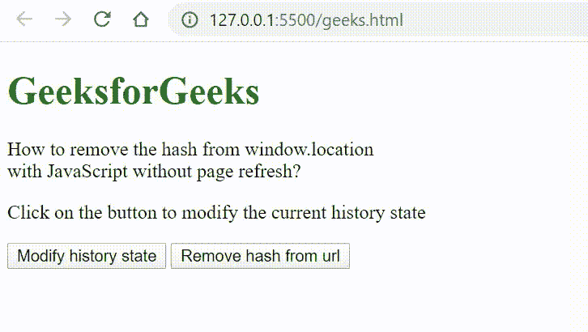

# 如何在不刷新页面的情况下，用 JavaScript 从 window.location 中移除 hash？

> 原文:[https://www . geesforgeks . org/如何从窗口位置移除哈希-有 JavaScript-无页面刷新/](https://www.geeksforgeeks.org/how-to-remove-hash-from-window-location-with-javascript-without-page-refresh/)

**replaceState()方法**用于修改当前历史条目，用方法参数中传递的状态对象、标题和 URL 进行替换。当您想要更新当前历史条目的状态对象或 URL 以响应某些用户操作时，此方法非常有用。要删除哈希 URL，可以使用历史 API 上的 replaceState 方法删除哈希位置。
**例:**

## 超文本标记语言

```html
<!DOCTYPE html>
<html>

<head>
    <title>
        How to remove hash from window.location
        with JavaScript without page refresh?
    </title>
</head>

<body style="text-align: center;">

    <h1 style="color: green">
        GeeksforGeeks
    </h1>

<p>
        How to remove the hash from
        window.location</br> with
        JavaScript without page refresh?
    </p>

<p>
        Click on the button to modify
        the current history state
    </p>

    <button onclick="modifyState()">
        Modify history state
    </button>

    <button onclick="remove_hash_from_url()">
        Remove hash from url
    </button>

    <script>
        function modifyState() {
            let stateObj = { id: "100" };
            window.history.replaceState(stateObj,
                "Page 3", "/answer#page3.html");
        }

        function remove_hash_from_url() {
            var uri = window.location.toString();

            if (uri.indexOf("#") > 0) {
                var clean_uri = uri.substring(0,
                                uri.indexOf("#"));

                window.history.replaceState({},
                        document.title, clean_uri);
            }
        }
    </script>
</body>

</html>
```

**输出:**

