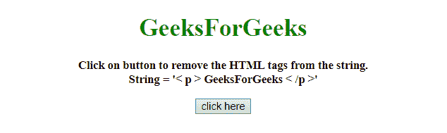
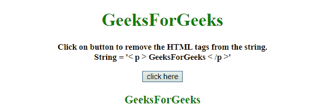

# 如何在 JavaScript 中移除带有 RegExp 的 HTML 标签？

> 原文:[https://www . geesforgeks . org/how-to-remove-html-tags-with-regexp-in-JavaScript/](https://www.geeksforgeeks.org/how-to-remove-html-tags-with-regexp-in-javascript/)

这里的任务是从字符串中移除 HTML 标记。这里字符串包含文档的一部分，我们只需要从中提取文本部分。在这里，我们将在 JavaScript 的帮助下做到这一点。

**进场:**

*   接受变量中的字符串。
*   小于符号的**和大于符号**的**之间的任何内容都将被正则表达式从字符串中移除。**
*   最后我们会得到文本。

**示例 1:** 该示例使用上面定义的方法。

```
<!DOCTYPE HTML>
<html>

<head>
    <title>
        How to remove HTML tags with RegExp in JavaScript?
    </title>
</head>

<body id="body" style="text-align:center;">
    <h1 style="color:green;">  
            GeeksForGeeks  
        </h1>
    <p id="GFG_UP" 
       style="font-size: 15px;
              font-weight: bold;">
    </p>
    <button onclick="GFG_Fun()">
        click here
    </button>
    <p id="GFG_DOWN" 
       style="color:green;
              font-size: 20px;
              font-weight: bold;">
    </p>
    <script>
        var up = document.getElementById('GFG_UP');
        var str2 = '<p> GeeksForGeeks </p>';

        // same as the str2. 
        var str1 = "< p > GeeksForGeeks < /p >"; 
        up.innerHTML = "Click on button to remove the "+
          "HTML tags from the string.<br>String = '" + str1 + "'";
        var down = document.getElementById('GFG_DOWN');

        function GFG_Fun() {
            var regex = /( |<([^>]+)>)/ig;
            down.innerHTML = str2.replace(regex, "");
        }
    </script>
</body>

</html>
```

**输出:**

*   **点击按钮前:**
    
*   **点击按钮后:**
    

**示例 2:** 该示例使用了上面定义的方法，但使用了不同的正则表达式。

```
<!DOCTYPE HTML>
<html>

<head>
    <title>
        How to remove HTML tags 
      with RegExp in JavaScript?
    </title>
</head>

<body id="body" style="text-align:center;">
    <h1 style="color:green;">  
            GeeksForGeeks  
        </h1>
    <p id="GFG_UP" 
       style="font-size: 15px;
              font-weight: bold;">
    </p>
    <button onclick="GFG_Fun()">
        click here
    </button>
    <p id="GFG_DOWN" 
       style="color:green; 
              font-size: 20px;
              font-weight: bold;">
    </p>
    <script>
        var up = document.getElementById('GFG_UP');
        var str2 = '<p> GeeksForGeeks </p>';

        // same as the str2.
        var str1 = "< p > GeeksForGeeks < /p >";  
        up.innerHTML = "Click on button to remove the HTML"+
          " tags from the string.<br>String = '" + str1 + "'";
        var down = document.getElementById('GFG_DOWN');

        function GFG_Fun() {
            var regex = /(<([^>]+)>)/ig;
            down.innerHTML = str2.replace(regex, "");
        }
    </script>
</body>

</html>
```

**输出:**

*   **点击按钮前:**
    
*   **点击按钮后:**
    