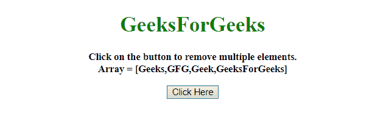
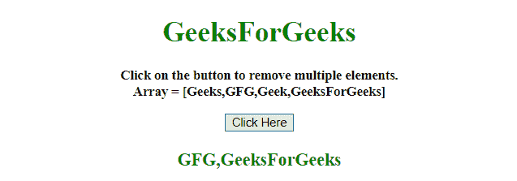
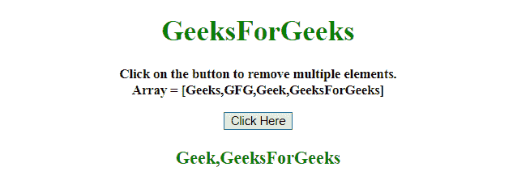

# 如何在 JavaScript 中移除数组中的多个元素？

> 原文:[https://www . geesforgeks . org/如何从 javascript 数组中移除多个元素/](https://www.geeksforgeeks.org/how-to-remove-multiple-elements-from-array-in-javascript/)

给定一个包含数组元素的数组，任务是使用 JavaScript 从数组中移除多个元素。给出了需要从 JavaScript 数组中移除的元素的索引。

**方法 1:**

*   将数组元素的索引存储到另一个需要移除的数组中。
*   开始一个循环，并运行到数组中的元素数。
*   使用 **[拼接()方法](https://www.geeksforgeeks.org/javascript-array-splice-method/)** 移除特定索引处的元素。

**示例 1:** 本示例使用[拼接()方法](https://www.geeksforgeeks.org/javascript-array-splice-method/)从数组中移除多个元素。

```
<!DOCTYPE HTML> 
<html> 

<head> 
    <title> 
        How to remove multiple elements
        from array in JavaScript ?
    </title>
</head> 

<body style = "text-align:center;"> 

    <h1 style = "color:green;" > 
        GeeksForGeeks 
    </h1>

    <p id = "GFG_UP" style = 
        "font-size: 15px; font-weight: bold;">
    </p>

    <button onclick = "GFG_Fun()">
        Click Here
    </button>

    <p id = "GFG_DOWN" style =
        "color:green; font-size: 20px; font-weight: bold;">
    </p>

    <script>
        var up = document.getElementById('GFG_UP'); 
        var down = document.getElementById('GFG_DOWN'); 
        var arr = ['Geeks', 'GFG', 'Geek', 'GeeksForGeeks'];

        up.innerHTML = "Click on the button to remove "
            + "multiple elements.<br>Array = [" + arr + "]"; 

        function GFG_Fun() { 
            remove = [0, 2];

            for (var i = remove.length -1; i >= 0; i--)
                arr.splice(remove[i], 1);

            down.innerHTML = arr;
        } 
    </script> 
</body> 

</html>
```

**输出:**

*   **点击按钮前:**
    
*   **点击按钮后:**
    

**方法 2:**

*   将数组元素的索引存储到另一个需要移除的数组中。
*   使用 **[滤镜()方法](https://www.geeksforgeeks.org/javascript-array-filter/)** 对元素数组进行操作。
*   使用 **[indexOf()方法](https://www.geeksforgeeks.org/javascript-array-indexof/)** 只选择索引数组中不存在的元素。

**示例 2:** 本示例使用[滤镜()方法](https://www.geeksforgeeks.org/javascript-array-filter/)和 [indexOf()方法](https://www.geeksforgeeks.org/javascript-array-indexof/)从数组中移除多个元素。

```
<!DOCTYPE HTML> 
<html> 

<head> 
    <title> 
        How to remove multiple elements
        from array in JavaScript ?
    </title>
</head> 

<body style = "text-align:center;"> 

    <h1 style = "color:green;" > 
        GeeksForGeeks 
    </h1>

    <p id = "GFG_UP" style = 
        "font-size: 15px; font-weight: bold;">
    </p>

    <button onclick = "GFG_Fun()">
        Click Here
    </button>

    <p id = "GFG_DOWN" style =
        "color:green; font-size: 20px; font-weight: bold;">
    </p>

    <script>
        var up = document.getElementById('GFG_UP'); 
        var down = document.getElementById('GFG_DOWN'); 
        var arr = ['Geeks', 'GFG', 'Geek', 'GeeksForGeeks'];

        up.innerHTML = "Click on the button to remove multiple"
                + " elements.<br>Array = [" + arr + "]"; 

        function GFG_Fun() {
            var indexes = [0, 1];

            arr = arr.filter(function(value, index) {
                return indexes.indexOf(index) == -1;
            })

            down.innerHTML = arr;
        } 
    </script> 
</body> 

</html>
```

**输出:**

*   **点击按钮前:**
    
*   **点击按钮后:**
    