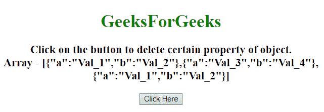
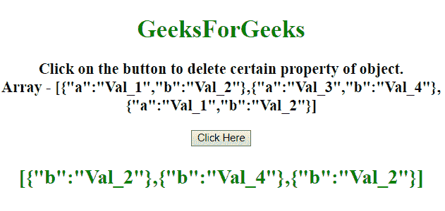

# 如何用 JavaScript 从对象数组中移除对象？

> 原文:[https://www . geesforgeks . org/如何使用 javascript 从对象数组中移除对象/](https://www.geeksforgeeks.org/how-to-remove-object-from-array-of-objects-using-javascript/)

给定一个包含对象的 JavaScript 数组，任务是从对象数组中删除某些对象。有两种方法可以解决这个问题，讨论如下:

**方法 1:**

*   使用 **array.forEach()方法**遍历数组中的每个对象。
*   对于每个对象，使用**删除对象属性**从对象数组中删除特定的对象元素。

**示例:**该示例实现了上述方法。

```
<!DOCTYPE HTML>
<html>

<head>
    <title>
        Remove certain property for all objects
        in array with JavaScript.
    </title>
</head>

<body style="text-align:center;">
    <h1 style="color: green">  
        GeeksForGeeks  
    </h1>
    <p id="GFG_UP"></p>

    <button onclick="gfg_Run()">
        Click Here
    </button>
    <p id="GFG_DOWN" 
       style="color:green;">
    </p>
    <script>
        var el_up = document.getElementById("GFG_UP");
        var el_down = document.getElementById("GFG_DOWN");
        var arr = [{
            a: 'Val_1',
            b: 'Val_2'
        }, {
            a: 'Val_3',
            b: 'Val_4'
        }, {
            a: 'Val_1',
            b: 'Val_2'
        }];
        el_up.innerHTML = "Click on the button to delete"
            + " certain property of object.<br>Array - "
            + JSON.stringify(arr);

        function gfg_Run() {
            arr.forEach(function(obj) {
                delete obj.a
            });
            el_down.innerHTML = JSON.stringify(arr);
        }
    </script>
</body>

</html>
```

**输出:**

*   **点击按钮前:**
    
*   **点击按钮后:**
    

**方法 2:**

*   使用 **array.map()方法**遍历数组中的每个对象。
*   对于每个对象，使用**删除对象属性**从对象数组中删除特定对象。

**示例:**该示例实现了上述方法。

```
<!DOCTYPE HTML>
<html>

<head>
    <title>
        Remove certain property for all
        objects in array with JavaScript.
    </title>
</head>

<body style="text-align:center;">
    <h1 style="color: green">  
        GeeksForGeeks  
    </h1>
    <p id="GFG_UP"></p>

    <button onclick="gfg_Run()">
        Click Here
    </button>
    <p id="GFG_DOWN"></p>

    <script>
        var el_up = document.getElementById("GFG_UP");
        var el_down = document.getElementById("GFG_DOWN");
        var arr = [{
            a: 'Val_1',
            b: 'Val_2'
        }, {
            a: 'Val_3',
            b: 'Val_4'
        }, {
            a: 'Val_1',
            b: 'Val_2'
        }];
        el_up.innerHTML = "Click on the button to delete"
            + " certain property of object.<br>Array - "
            + JSON.stringify(arr);

        function gfg_Run() {
            arr.map(function(obj) {
                delete obj.a;
                return obj;
            });
            el_down.innerHTML = JSON.stringify(arr);
        }
    </script>
</body>

</html>
```

**输出:**

*   **点击按钮前:**
    
*   **点击按钮后:**
    