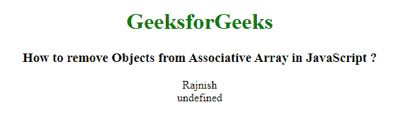
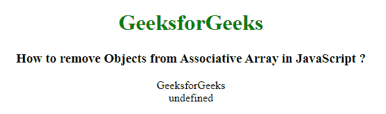

# 如何在 JavaScript 中移除关联数组中的对象？

> 原文:[https://www . geesforgeks . org/如何从 javascript 关联数组中移除对象/](https://www.geeksforgeeks.org/how-to-remove-objects-from-associative-array-in-javascript/)

创建一个包含键值对的关联数组，任务是使用 JavaScript 从关联数组中移除对象。我们可以使用 **delete** 关键字从 JavaScript 关联数组中移除对象。

**方法:**声明一个包含键值对对象的关联数组。然后使用 delete 关键字从关联数组中删除数组对象。

**示例 1:** 本示例使用 delete 关键字从关联数组中移除对象。

```
<!DOCTYPE html>
<html>

<head>
    <title>
        How to remove Objects from
        Associative Array in JavaScript ?
    </title>
</head>

<body style="text-align:center;">

    <h1 style="color:green;">
        GeeksforGeeks
    </h1>

    <h3>
        How to remove Objects from
        Associative Array in JavaScript ?
    </h3>

    <script>

        // JavaScript code to remove
        // objects from associative array
        function deleteObjects(){

            // Declaring an associative 
            // array of objects
            var arr = new Object();

            // Adding objects in array
            arr['key'] = 'Value';
            arr['geeks'] = 'GeeksforGeeks';
            arr['name'] = 'Rajnish';

            // Checking object exist or not
            document.write(arr['name'] + '</br>');

            // Removing object from
            // associative array
            delete arr['name'];

            // It gives result as undefined
            // as object is deleted
            document.write(arr['name'] + '</br>');
        }

        // Calling function
        deleteObjects();
    </script>
</body>

</html>
```

**输出:**


**示例 2:** 本示例使用 delete 关键字从关联数组中移除对象。

```
<!DOCTYPE html>
<html>

<head>
    <title>
        How to remove Objects from
        Associative Array in JavaScript ?
    </title>
</head>

<body style="text-align:center;">

    <h1 style="color:green;">
        GeeksforGeeks
    </h1>

    <h3>
        How to remove Objects from
        Associative Array in JavaScript ?
    </h3>

    <script>

        // JavaScript code to remove
        // objects from associative array
        function deleteObjects(){

            // Declaring an associative 
            // array of objects
            var arr = new Object();

            // Adding objects in array
            arr['key'] = 'Value';
            arr['geeks'] = 'GeeksforGeeks';
            arr['name'] = 'Rajnish';

            // Checking object exist or not
            document.write(arr['geeks'] + '</br>');

            // Removing object from
            // associative array
            delete arr.geeks;

            // It gives result as undefined
            // as object is deleted
            document.write(arr['geeks'] + '</br>');
        }

        // Calling function
        deleteObjects();
    </script>
</body>

</html>
```

**输出:**
