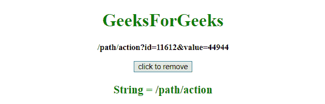

# 如何在 JavaScript 中删除某个字符后的部分字符串？

> 原文:[https://www . geesforgeks . org/如何删除 javascript 中某些字符后的字符串部分/](https://www.geeksforgeeks.org/how-to-remove-portion-of-a-string-after-certain-character-in-javascript/)

给定一个网址，任务是使用 JavaScript 删除某个字符后的一部分网址。

*   **split() method:** This method is used to split a string into an array of substrings, and returns the new array.

    **语法:**

    ```
    string.split(separator, limit)
    ```

    **参数:**

    *   **分隔符:**为可选参数。它指定用于拆分字符串的字符或正则表达式。如果不使用，将返回整个字符串(只有一项的数组)。
    *   **极限:**为可选参数。它指定指定拆分次数的整数，超出拆分限制的项目将从数组中排除。

    **返回值:**返回一个新数组，包含拆分后的项目。

*   **JavaScript String substring() Method:** This method gets the characters from a string, between two defined indices, and returns the new sub string. This method gets the characters in a string between “start” and “end”, excluding “end” itself.

    **语法:**

    ```
    string.substring(start, end)
    ```

    **参数:**

    *   **启动:**为必输参数。它指定开始提取的位置。第一个字符的索引从 0 开始。
    *   **结束:**为可选参数。它指定停止提取的位置(eccluding)。如果不使用，它将提取整个字符串。

    **返回值:**返回包含提取字符的新字符串。

**示例 1:** 本示例使用 **substring()方法**删除字符串中特定字符(？).

```
<!DOCTYPE HTML> 
<html> 
    <head> 
        <title> 
            Remove portion of string after
            certain characters
        </title>
    </head> 

    <body style = "text-align:center;"> 

        <h1 style = "color:green;" > 
            GeeksForGeeks 
        </h1>

        <p id = "GFG_UP" style = "font-size: 15px; font-weight: bold;">
        </p>

        <button onclick = "GFG_click()">
            click to remove
        </button>

        <p id = "GFG_DOWN" style = 
            "color:green; font-size: 20px; font-weight: bold;">
        </p>

        <script>
            var el_up = document.getElementById("GFG_UP");
            var el_down = document.getElementById("GFG_DOWN");
            var s = '/path/action?id=11612&value=44944';
            el_up.innerHTML = s;         

            function GFG_click() {
                s = s.substring(0, s.indexOf('?'));
                el_down.innerHTML = "String = "+s;
            }         
        </script> 
    </body> 
</html>                    
```

**输出:**

*   **点击按钮前:**
    
*   **点击按钮后:**
    

**示例 2:** 本示例使用 **split()方法**删除字符串中某个字符(？).

```
<!DOCTYPE HTML> 
<html> 
    <head> 
        <title> 
            Remove portion of string after 
            certain character
        </title>
    </head> 

    <body style = "text-align:center;"> 
        <h1 style = "color:green;" > 
            GeeksForGeeks 
        </h1>

        <p id = "GFG_UP" style = "font-size: 15px; font-weight: bold;">
        </p>

        <button onclick = "GFG_click()">
            click to remove
        </button>

        <p id = "GFG_DOWN" style = 
            "color:green; font-size: 20px; font-weight: bold;">
        </p>

        <script>
            var el_up = document.getElementById("GFG_UP");
            var el_down = document.getElementById("GFG_DOWN");
            var s = '/path/action?id=11612&value=44944';
            el_up.innerHTML = s;         

            function GFG_click() {
                s = s.split('?')[0]
                el_down.innerHTML = "String = " + s;
            }         
        </script> 
    </body> 
</html>                    
```

**输出:**

*   **点击按钮前:**
    
*   **点击按钮后:**
    