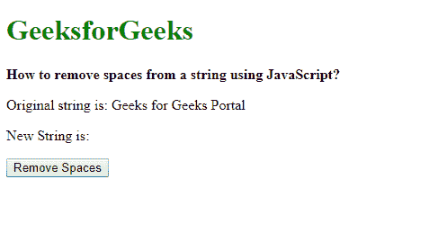
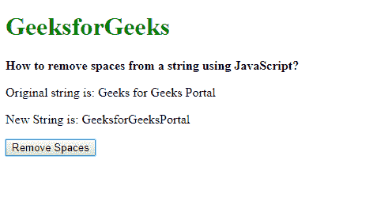

# 如何用 JavaScript 删除字符串中的空格？

> 原文:[https://www . geesforgeks . org/如何使用 javascript 从字符串中删除空格/](https://www.geeksforgeeks.org/how-to-remove-spaces-from-a-string-using-javascript/)

**方法 1:使用 split()和 join()方法:**使用 **split()** 方法将一个字符串拆分为多个子字符串，并以数组的形式返回。可以将分隔符指定为参数，以便在字符串中找到该分隔符时拆分字符串。在此参数中指定了空格字符(" ")，以便在出现空格时分隔字符串。

join()方法用于使用分隔符连接字符串数组。这将使用指定的分隔符返回带有联接字符串的新字符串。此方法用于返回的数组，并且不使用分隔符("")来连接字符串。这将连接数组中的字符串并返回一个新字符串。这将删除原始字符串中的所有空格。

**语法:**

```
string.split(" ").join("")
```

**示例:**

```
<!DOCTYPE html>
<html>

<head>
    <title>
        How to remove spaces from
        a string using JavaScript?
    </title>
</head>

<body>
    <h1 style="color: green">
        GeeksforGeeks
    </h1>

    <b>
        How to remove spaces from
        a string using JavaScript?
    </b>

    <p>
        Original string is: 
        Geeks for Geeks Portal
    </p>

    <p>
        New String is: 
        <span class="output"></span>
    </p>

    <button onclick="removeSpaces()">
        Remove Spaces
    </button>

    <script type="text/javascript">
        function removeSpaces() {
            originalText = 
                "Geeks for Geeks Portal";

            removedSpacesText = 
                originalText.split(" ").join("");

            document.querySelector('.output').textContent
                    = removedSpacesText;
        }
    </script>
</body>

</html>
```

**输出:**

*   **点击按钮前:**
    
*   **点击按钮后:**
    

**方法二:使用 regex 替换()方法:**使用**替换()**方法将指定的字符串替换为另一个字符串。它需要两个参数，第一个是要替换的字符串，第二个参数是替换为的字符串。第二个字符串可以作为空字符串给出，以便空的空间被替换。

第一个参数是一个带有空格字符(" ")和全局属性的正则表达式。这将选择字符串中出现的每一个空格，然后可以通过在第二个参数中使用空字符串来删除它。这将删除原始字符串中的所有空格。

**语法:**

```
string.replace(/ /g, "")
```

**示例:**

```
<!DOCTYPE html>
<html>

<head>
    <title>
        How to remove spaces from
        a string using JavaScript?
    </title>
</head>

<body>
    <h1 style="color: green">
        GeeksforGeeks
    </h1>

    <b>
        How to remove spaces from
        a string using JavaScript?
    </b>

    <p>
        Original string is: 
        Geeks for Geeks Portal
    </p>

    <p>
        New String is: 
        <span class="output"></span>
    </p>

    <button onclick="removeSpaces()">
        Remove Spaces
    </button>

    <script type="text/javascript">
        function removeSpaces() {
            originalText = 
                "Geeks for Geeks Portal";

            newText = 
                originalText.replace(/ /g, "");

            document.querySelector('.output').textContent
                    = newText;
        }
    </script>
</body>

</html>
```

**输出:**

*   **点击按钮前:**
    
*   **点击按钮后:**
    