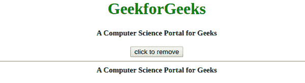

# 如何使用 JavaScript 移除特定的 div 元素？

> 原文:[https://www . geesforgeks . org/如何使用 javascript 删除特定于 div 的元素/](https://www.geeksforgeeks.org/how-to-remove-specific-div-element-by-using-javascript/)

在本文中，我们将讨论三种使用普通 Javascript 移除特定“div”元素的简单方法。
**使用 parentNode.removeChild():** 此方法从 DOM 树中移除指定的子节点，并返回移除的节点。

*   **语法:**

```
element.parentNode.removeChild(element)
```

*   **示例:**本示例使用 **parentNode.removeChild()方法**移除特定的“div”元素。

## 超文本标记语言

```
<!DOCTYPE html>
<html>
    <head>
        <title>
            Remove specific divisible
            element using Javascript
        </title>
    </head>
    <body style="text-align: center;">
        <h1 style="color: green;">
          GeekforGeeks
        </h1>
        <div id="gfg_up"
             style="font-size: 15px;
                    font-weight: bold;">
            A Computer Science Portal for Geeks
        </div>
        <br />
        <button onclick="GFG_click()">
            click to remove
        </button>
        <hr />
        <div id="gfg_down"
             style="font-size: 15px;
                    font-weight: bold;">
            A Computer Science Portal for Geeks
        </div>

        <script type="text/javascript">
            function GFG_click() {
                var gfg_down =
                document.getElementById("gfg_down");
                gfg_down.parentNode.removeChild(gfg_down);
            }
        </script>
    </body>
</html>
```

*   **输出:**



**使用外部 HTML 属性:**外部 HTML 属性用于设置 HTML 元素的内容。因此，我们可以通过使用 outerHTML 属性将其内容设置为“”来移除指定的“div”元素。

*   **语法:**

```
element.outerHTML=""
```

*   **示例:**本示例使用**外部 HTML 属性**移除特定的“div”元素。

## 超文本标记语言

```
<!DOCTYPE html>
<html>
    <head>
        <title>
            Remove specific divisible
            element using Javascript
        </title>
    </head>
    <body style="text-align: center;">
        <h1 style="color: green;">
        GeekforGeeks
        </h1>
        <div id="gfg_up"
            style="font-size: 15px;
                    font-weight: bold;">
            A Computer Science Portal for Geeks
        </div>
        <br />
        <button onclick="GFG_click()">
            click to remove
        </button>
        <hr />
        <div id="gfg_down"
            style="font-size: 15px;
                    font-weight: bold;">
            A Computer Science Portal for Geeks
        </div>

        <script type="text/javascript">
            function GFG_click() {
                document.getElementById("gfg_down")
                .outerHTML = "";
            }
        </script>
    </body>
</html>                   
```

*   **输出:**


**使用。remove():** 此方法移除指定的 div 元素及其所有子节点。

*   **语法:**

```
element.remove()
```

*   **示例:**本示例使用 **remove()方法**移除特定的“div”元素。

## 超文本标记语言

```
<!DOCTYPE html>
<html>
    <head>
        <title>
            Remove specific divisible
            element using Javascript
        </title>
    </head>
    <body style="text-align: center;">
        <h1 style="color: green;">
          GeekforGeeks
        </h1>
        <div id="gfg_up"
             style="font-size: 15px;
                    font-weight: bold;">
            A Computer Science Portal for Geeks
        </div>
        <br />
        <button onclick="GFG_click()">
            click to remove
        </button>
        <hr />
        <div id="gfg_down"
             style="font-size: 15px;
                    font-weight: bold;">
            A Computer Science Portal for Geeks
        </div>
        <script type="text/javascript">
            function GFG_click() {
                var gfg_down =
                document.getElementById("gfg_down");
                gfg_down.remove();
            }
        </script>
    </body>
</html>
```

*   **输出:**

