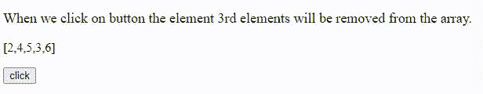

# 如何使用 JavaScript 从给定的元素数组左侧移除特定元素？

> 原文:[https://www . geesforgeks . org/如何使用 javascript 从给定元素数组的左侧移除特定元素/](https://www.geeksforgeeks.org/how-to-remove-specific-elements-from-the-left-of-a-given-array-of-elements-using-javascript/)

在本文中，我们将学习如何使用 JavaScript 从给定元素数组的左侧移除特定元素。我们已经给出了一个元素数组，我们必须从给定数组的左边移除特定的元素。

**方法:****[**拼接()**](https://www.geeksforgeeks.org/javascript-array-splice-method/) 方法用于在数组中添加和移除元素。要从给定数组的左侧移除特定元素，我们将使用拼接方法。要删除特定元素，需要两个参数索引表，其中我们要删除元素，以及我们要删除的元素的数量。它返回一个包含移除元素的数组。**

****语法:****

```
array.splice(index,No_of_element);
```

****示例:****

## **超文本标记语言**

```
<!DOCTYPE html>
<html>
  <body>
    <div>
      <p id="p" style="font-size: 18px">
        When we click on button the element 
        3rd elements will be removed from
        the array.
      </p>

      <p id="gfg">[2,4,5,3,6]</p>

      <button onclick="fun(5)">click</button>
    </div>

    <script>
      function fun(n) {
        // Array
        var arr = [2, 4, 5, 3, 6];

        // Find index of specified element which is n
        var ind = arr.indexOf(n);

        // And remove n from array
        arr.splice(ind, 1);
        document.getElementById("p").innerHTML = 
        "After remove element";

        // Final result after remove n from array
        document.getElementById("gfg").innerHTML = 
        "[" + arr + "]";
      }
    </script>
  </body>
</html>
```

****输出:****

****