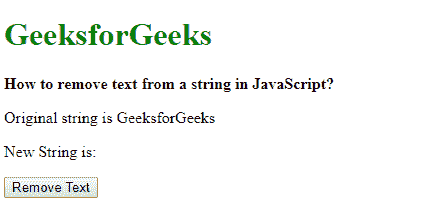
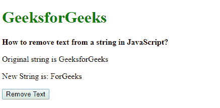
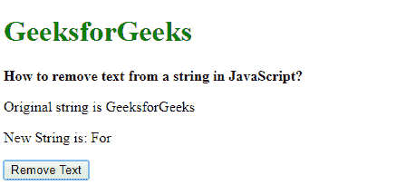
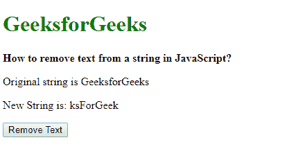

# 如何在 JavaScript 中删除字符串中的文本？

> 原文:[https://www . geesforgeks . org/如何从 javascript 字符串中移除文本/](https://www.geeksforgeeks.org/how-to-remove-text-from-a-string-in-javascript/)

从字符串中删除文本有三种方法，如下所示:

**方法一:使用[替换()方法](https://www.geeksforgeeks.org/javascript-string-replace/) :** 替换方法可以用另一个字符串替换指定的字符串。它需要两个参数，第一个是要替换的字符串，第二个是从第一个字符串替换的字符串。可以给第二个字符串一个空字符串，以便删除要替换的文本。但是，此方法仅移除字符串的第一个匹配项。

**语法:**

```
string.replace('textToReplace', '');
```

**示例:**本示例替换第一个出现的字符串。

```
<!DOCTYPE html>
<html>

<head>
    <title>
        How to remove text from
        a string in JavaScript?
    </title>
</head>

<body>
    <h1 style="color: green">
        GeeksforGeeks
    </h1>

    <b>
        How to remove text from a
        string in JavaScript?
    </b>

    <p>Original string is GeeksforGeeks</p>

    <p>
        New String is: <span class="output"></span>
    </p>

    <button onclick="removeText()">
        Remove Text
    </button>

    <script type="text/javascript">
        function removeText() {
            originalText = 'GeeksForGeeks';
            newText = originalText.replace('Geeks', '');

            document.querySelector('.output').textContent
                    = newText;
        }
    </script>
</body>
</html>                    
```

**输出:**

*   **点击按钮前:**
    
*   **点击按钮后:**
    

**方法 2:使用 replace()方法替换正则表达式:**该方法用于移除指定字符串的所有匹配项，与之前的方法不同。使用正则表达式代替字符串和全局属性。这将选择字符串中的每个匹配项，并且可以通过在第二个参数中使用空字符串来移除它。

**语法:**

```
string.replace(/regExp/g, '');
```

**示例:**

```
<!DOCTYPE html>
<html>

<head>
    <title>
        How to remove text from a
        string in JavaScript?
    </title>
</head>

<body>
    <h1 style="color: green">
        GeeksforGeeks
    </h1>

    <b>
        How to remove text from a 
        string in JavaScript?
    </b>

    <p>Original string is GeeksforGeeks</p>

    <p>
        New String is: <span class="output"></span>
    </p>

    <button onclick="removeText()">
        Remove Text
    </button>

    <script type="text/javascript">
        function removeText() {
            originalText = 'GeeksForGeeks';
            newText = originalText.replace(/Geeks/g, '');

            document.querySelector('.output').textContent
                    = newText;
        }
    </script>
</body>
</html>                    
```

**输出:**

*   **点击按钮前:**
    
*   **点击按钮后:**
    

**方法 3:使用 substr()方法:**substr()方法用于提取给定参数之间的字符串部分。此方法采用两个参数，一个是起始索引，另一个是要从该索引中选择的字符串长度。通过指定所需字符串的所需长度，可以丢弃另一部分。这可用于删除字符串中的前缀或后缀。

**语法:**

```
string.substr(start, length);
```

**示例:**

```
<!DOCTYPE html>
<html>

<head>
    <title>
        How to remove text from a
        string in JavaScript?
    </title>
</head>

<body>
    <h1 style="color: green">
        GeeksforGeeks
    </h1>

    <b>
        How to remove text from a
        string in JavaScript?
    </b>

    <p>Original string is GeeksforGeeks</p>

    <p>
        New String is: <span class="output"></span>
    </p>

    <button onclick="removeText()">
        Remove Text
    </button>

    <script type="text/javascript">
        function removeText() {
            originalText = 'GeeksForGeeks';
            newText = originalText.substr(3, 9);

            document.querySelector('.output').textContent
                    = newText;
        }
    </script>
</body>

</html>                    
```

**输出:**

*   **点击按钮前:**
    
*   **点击按钮后:**
    