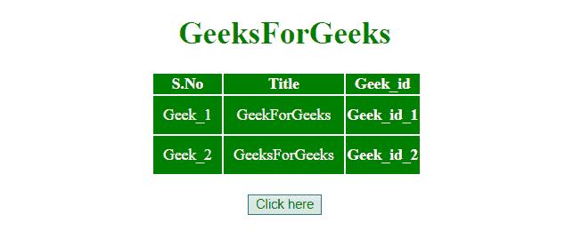
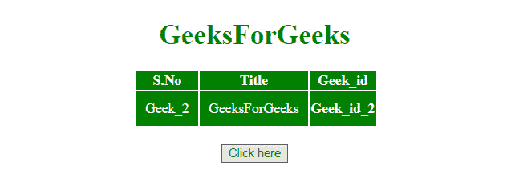
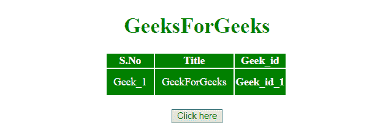

# 如何用 JavaScript 删除表格中的表格行？

> 原文:[https://www . geesforgeks . org/如何使用 javascript 删除表中的表行/](https://www.geeksforgeeks.org/how-to-remove-the-table-row-in-a-table-using-javascript/)

remove()方法用于使用 JavaScript 从 HTML 表中移除表行。

**移除()方法:**此方法移除选定的元素以及文本和子节点。此方法还会移除选定元素的数据和事件。

**语法:**

```
node.remove()
```

**示例 1:** 本示例首先通过 **id 值**选择行，然后使用 **remove()方法**将其删除。

```
<!DOCTYPE HTML> 
<html> 
    <head> 
        <title> 
            How to remove a table row
            from table
        </title> 

        <style>
            #myCol {
                background:green;
            }
            table {
                color:white;
            }
            #Geek_p {
                color:green;
                font-size:30px;
            }
            td {
                padding:10px;
            }
        </style>
    </head> 

    <body> 
        <center>
        <h1 style = "color:green;" > 
            GeeksForGeeks 
        </h1> 

        <table>
            <colgroup>
                <col id="myCol"
                    span="2">
                <col style="background-color:green">
            </colgroup>

            <tr>
                <th>S.No</th>
                <th>Title</th>
                <th>Geek_id</th>
            </tr>
            <tr id = "row1">
                <td>Geek_1</td>
                <td>GeekForGeeks</td>
                <th>Geek_id_1</th>
            </tr>
            <tr>
                <td>Geek_2</td>
                <td>GeeksForGeeks</td>
                <th>Geek_id_2</th>
            </tr>
        </table>

        <br>

        <button onclick = "Geeks()"> 
            Click here
        </button> 

        <script> 
            function Geeks() {
                document.getElementById("row1").remove();
            }
        </script> 
        </center>
    </body> 
</html>                    
```

**输出:**

*   **点击按钮前:**
    
*   **点击按钮后:**
    

**示例 2:** 本示例首先使用**标签名**选择行，然后使用 **remove()方法**通过索引删除适当的元素。

```
<!DOCTYPE HTML> 
<html> 
    <head> 
        <title> 
            How to remove a table row
            in a table
        </title> 

        <style>
            #myCol {
                background:green;
            }
            table {
                color:white;
            }
            #Geek_p {
                color:green;
                font-size:30px;
            }
            td {
                padding:10px;
            }
        </style>
    </head>

    <body> 
        <center>
            <h1 style = "color:green;" > 
                GeeksForGeeks 
            </h1> 

            <table>
                <colgroup>
                    <col id="myCol"
                        span="2">
                    <col style="background-color:green">
                </colgroup>

                <tr>
                    <th>S.No</th>
                    <th>Title</th>
                    <th>Geek_id</th>
                </tr>
                <tr id = "row1">
                    <td>Geek_1</td>
                    <td>GeekForGeeks</td>
                    <th>Geek_id_1</th>
                </tr>
                <tr>
                    <td>Geek_2</td>
                    <td>GeeksForGeeks</td>
                    <th>Geek_id_2</th>
                </tr>
            </table>
            <br>

            <button onclick = "Geeks()"> 
                Click here
            </button> 

            <script> 
                function Geeks() {
                    document.getElementsByTagName("tr")[2].remove();
                }
            </script> 
        </center>
    </body> 
</html>                    
```

**输出:**

*   **点击按钮前:**
    
*   **点击按钮后:**
    