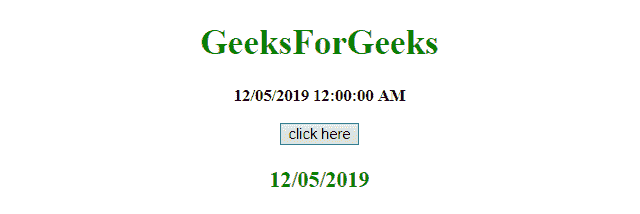
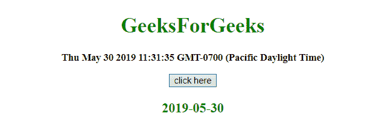

# 如何使用 JavaScript 从日期中移除时间？

> 原文:[https://www . geesforgeks . org/如何使用 javascript 从日期中删除时间/](https://www.geeksforgeeks.org/how-to-remove-time-from-date-using-javascript/)

给定一个日期对象，任务是使用 JavaScript 删除对象的时间部分。

**split()方法:**该方法用于将一个字符串拆分为一个子字符串数组，并返回新数组。

**语法:**

```
string.split( separator, limit )
```

**参数:**

*   **分隔符:**此参数为可选。它指定用于拆分字符串的字符或正则表达式。如果不使用，将返回整个字符串(只有一项的数组)。
*   **极限:**此参数为可选。它指定指定拆分次数的整数，超出拆分限制的项目将从数组中排除。

**返回值:**返回一个新数组，包含拆分后的项目。

**示例 1:** 本示例使用(“”)分割日期，然后使用**分割()方法**获取分割后返回的数组的索引= 0 处的值。

```
<!DOCTYPE HTML> 
<html> 
    <head> 
        <title> 
            Remove time from date
        </title>     
    </head> 

    <body style = "text-align:center;">

        <h1 style = "color:green;" > 
            GeeksForGeeks 
        </h1>

        <p id = "GFG_UP" style = 
            "font-size: 15px; font-weight: bold;">
        </p>

        <button onclick = "GFG_Fun()">
            click here
        </button>

        <p id = "GFG_DOWN" style =
            "color:green; font-size: 20px; font-weight: bold;">
        </p>

        <script>
            var up = document.getElementById('GFG_UP');
            var d = '12/05/2019 12:00:00 AM';
            up.innerHTML = d;
            var down = document.getElementById('GFG_DOWN'); 

            function GFG_Fun() {
                down.innerHTML = d.split(' ')[0];;
            }
        </script> 
    </body> 
</html>                    
```

**输出:**

*   **点击按钮前:**
    
*   **点击按钮后:**
    

**例 2:** 这个例子和上一个很相似。本示例首先使用(')分割日期，然后使用**分割()方法**获取分割后返回的数组的索引= 0 处的值。它适用于日期对象。

```
<!DOCTYPE HTML> 
<html> 
    <head> 
        <title> 
            Remove time from date
        </title>     
    </head> 

    <body style = "text-align:center;">

        <h1 style = "color:green;" > 
            GeeksForGeeks 
        </h1>

        <p id = "GFG_UP" style = 
            "font-size: 15px; font-weight: bold;">
        </p>

        <button onclick = "GFG_Fun()">
            click here
        </button>

        <p id = "GFG_DOWN" style = 
            "color:green; font-size: 20px; font-weight: bold;">
        </p>

        <script>
            var up = document.getElementById('GFG_UP');
            var d = new Date();
            up.innerHTML = d;
            var down = document.getElementById('GFG_DOWN'); 

            function GFG_Fun() {
                down.innerHTML = d.toISOString().split('T')[0];
            }
        </script> 
    </body> 
</html>                    
```

**输出:**

*   **点击按钮前:**
    
*   **点击按钮后:**
    