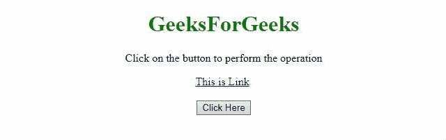
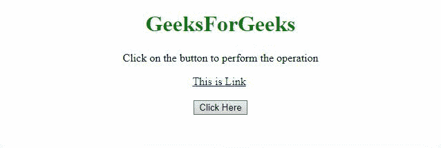

# 如何用 JavaScript 去除链接下划线？

> 原文:[https://www . geesforgeks . org/如何使用 javascript 从链接中删除下划线/](https://www.geeksforgeeks.org/how-to-remove-underline-from-link-using-javascript/)

给定一个链接，任务是在 JavaScript 的帮助下移除锚元素的下划线。下面讨论两种方法:

**方法 1:** 使用 JavaScript 的[**text Detailing 属性**](https://www.geeksforgeeks.org/html-dom-style-textdecoration-property/) 执行此操作。它可以设置为许多值，但在本例中，它被设置为**无**。

*   **例:**

    ```html
    <!DOCTYPE HTML>
    <html>

    <head>
        <title>
            How to remove underline from
            link using JavaScript?
        </title>
    </head>

    <body style="text-align:center;">

        <h1 style="color:green;">
            GeeksForGeeks
        </h1>

        <p id="GFG_UP"></p>

        <a id="link" href="#">This is Link</a>

        <br><br>

        <button onclick="GFG_Fun()">
            Click Here
        </button>

        <p id="GFG_DOWN"></p>

        <script>
            var el_up = document.getElementById('GFG_UP');
            var el_down = document.getElementById('GFG_DOWN');
            el_up.innerHTML = "Click on the button to "
                            + "perform the operation";

            function GFG_Fun() {
                var el = document.getElementById('link');
                el.style.textDecoration = "none";
                el_down.innerHTML = "Underline Removed";
            }
        </script>
    </body>

    </html>
    ```

*   **输出:**
    

**方法二:**使用 JavaScript 的[**text Detailing 属性**](https://www.geeksforgeeks.org/html-dom-style-textdecoration-property/) 执行操作。但是，在本例中，我们将该值设置为**至**线。

*   **例:**

    ```html
    <!DOCTYPE HTML>
    <html>

    <head>
        <title>
            How to remove underline from
            link using JavaScript?
        </title>
    </head>

    <body style="text-align:center;">

        <h1 style="color:green;">
            GeeksForGeeks
        </h1>

        <p id="GFG_UP"></p>

        <a id="link" href="#">This is Link</a>

        <br><br>
        <button onclick="GFG_Fun()">
            Click Here
        </button>

        <p id="GFG_DOWN"></p>

        <script>
            var el_up = document.getElementById('GFG_UP');
            var el_down = document.getElementById('GFG_DOWN');
            el_up.innerHTML = "Click on the button to "
                            + "perform the operation";

            function GFG_Fun() {
                var el = document.getElementById('link');
                el.style.textDecoration = "line-through";
                el_down.innerHTML = "Underline Removed";
            }
        </script>
    </body>

    </html>
    ```

*   **输出:**
    