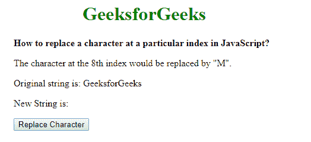
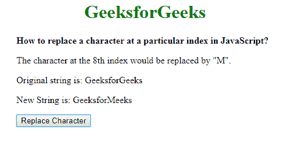

# 如何在 JavaScript 中替换特定索引处的字符？

> 原文:[https://www . geesforgeks . org/如何在 javascript 中替换特定索引字符/](https://www.geeksforgeeks.org/how-to-replace-a-character-at-a-particular-index-in-javascript/)

要替换字符串中的字符，有几种流行的方法，这是我们将在本文中描述的两种最流行的方法。第一种方法是使用 substr()方法。在第二种方法中，我们将字符串转换为数组，并替换索引处的字符。这两种方法描述如下:

**使用 substr()方法:**substr()方法用于从给定的起始索引到另一个索引提取子字符串。这可用于提取字符串中除要替换的字符之外的部分。

字符串的第一部分可以通过使用起始索引参数“0”(表示字符串的起始)和长度参数作为必须替换字符的索引来提取。

字符串的第二部分可以通过使用起始索引参数“index + 1”来提取，该参数表示字符串中位于字符索引之后的部分。省略第二个参数以获取它后面的整个字符串。

新字符串是通过将字符串的两个部分连接在一起并在两部分之间添加要替换的字符而创建的。这将创建一个新字符串，在索引处替换该字符。

*   **语法:**

    ```
    function replaceChar(origString, replaceChar, index) {
        let firstPart = origString.substr(0, index);
        let lastPart = origString.substr(index + 1);

        let newString = firstPart + replaceChar + lastPart;
        return newString;
    }

    ```

*   **例:**

    ```
    <!DOCTYPE html>
    <html>

    <head>
        <title>
            How to replace a character at a
            particular index in JavaScript?
        </title>

        <style>
            .container{
                text-align: left;
                width:500px;
                padding-left:60px;
            }

        </style>
    </head>

    <body>
        <center>
            <h1 style="color: green">
                GeeksforGeeks
            </h1>

            <div class="container">
                <b>
                    How to replace a character at a
                    particular index in JavaScript?
                </b>

                <p>
                    The character at the 8th index
                    would be replaced by "M".
                </p>

                <p>
                    Original string is: GeeksforGeeks
                </p>

                <p>
                    New String is:
                    <span class="output"></span>
                </p>

                <button onclick="changeText()">
                    Replace Character
                </button>
            </div>
        </center>

        <script type="text/javascript">
            function replaceChar(origString, replaceChar, index)
            {
                let firstPart = origString.substr(0, index);

                let lastPart = origString.substr(index + 1);

                let newString = 
                    firstPart + replaceChar + lastPart;

                return newString;
            }

            function changeText() {
                originalText = "GeeksforGeeks";

                charReplaced =
                    replaceChar(originalText, "M", 8);

                document.querySelector('.output').textContent
                        = charReplaced;
            }
        </script>
    </body>

    </html>
    ```

*   **输出:**
    **点击按钮前:**
    
    **点击按钮后:**
    

**将字符串转换为数组并替换索引处的字符:**使用 split()方法将字符串转换为数组，分隔符为空白字符(" ")。这将把字符串分割成一个数组，并使每个字符都可以作为数组的索引访问。

然后，必须替换的字符可以简单地分配给数组的相应索引。使用 join()方法将数组连接回字符串，分隔符为空白字符(" ")。这将创建一个新字符串，在索引处替换该字符。

*   **语法:**

    ```
    function replaceChar(origString, replaceChar, index) {
        let newStringArray = origString.split("");

        newStringArray[index] = replaceChar;

        let newString = newStringArray.join("");

        return newString;
    }
    ```

*   **例:**

    ```
    <!DOCTYPE html>
    <html>

    <head>
        <title>
            How to replace a character at a
            particular index in JavaScript?
        </title>

        <style>
            .container {
                text-align: left;
                width: 500px;
                padding-left: 60px;
            }
        </style>
    </head>

    <body>
        <center>
            <h1 style="color: green">
                GeeksforGeeks
            </h1>

            <div class="container">
                <b>
                    How to replace a character at a
                    particular index in JavaScript?
                </b>

                <p>
                    The character at the 8th index
                    would be replaced by "M".
                </p>

                <p>
                    Original string is: GeeksforGeeks
                </p>

                <p>
                    New String is:
                    <span class="output"></span>
                </p>

                <button onclick="changeText()">
                    Replace Character
                </button>
            </div>
        </center>

        <script type="text/javascript">
            function replaceChar(origString, replaceChar, index)
            {
                let newStringArray = origString.split("");

                newStringArray[index] = replaceChar;

                let newString = newStringArray.join("");

                return newString;
            }

            function changeText() {

                originalText = "GeeksforGeeks";

                charReplaced =
                    replaceChar(originalText, "M", 8);

                document.querySelector('.output').textContent
                            = charReplaced;
            }
        </script>
    </body>

    </html>
    ```

*   **输出:**
    **点击按钮前:**
    
    **点击按钮后:**
    