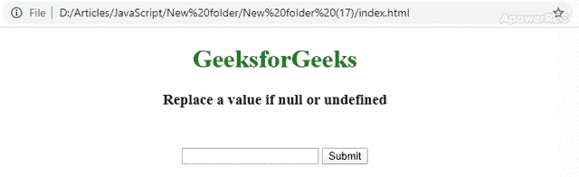

# 如果在 JavaScript 中为空或未定义，如何替换一个值？

> 原文:[https://www . geesforgeks . org/如何在 javascript 中替换值 if-null 或-undefined/](https://www.geeksforgeeks.org/how-to-replace-a-value-if-null-or-undefined-in-javascript/)

在 JavaScript 中，如果变量没有用任何值初始化，那么它将被设置为**未定义**。如果某个值未定义，我们可以设置默认值。这可以通过两种方式实现。

**示例 1:** 通过使用 if 检查(强力)。在这种方法中，我们将手动检查一个值是**不为空**还是**不未定义**，如果是，则将其设置为某个默认值。

*   **例:**

    ```html
    <!DOCTYPE html>
    <html lang="en">

    <head>
        <meta charset="UTF-8">
        <meta name="viewport"
            content="width=device-width, initial-scale=1.0">
        <meta http-equiv="X-UA-Compatible"
            content="ie=edge">
        <title>Demo</title>
    </head>

    <body>
        <h1 style="color: green; 
                text-align: center;">
            GeeksforGeeks
        </h1>
        <h3 style="text-align: center;">
            Replace a value if null or undefined
        </h3>
        <div style="margin-top: 50px;
                    text-align: center;">
            <input type="text" id="anyId">
            <button type="submit"
                    onclick="defaultValue_ifcheck()">
            Submit
            </button>
        </div>

        <script>

            // By using if-check 
            function defaultValue_ifcheck() {
                var oldValue = document.getElementById("anyId").value;
                var newValue;
                if (!oldValue) {
                    newValue = 
                    "This is default value: Geeksforgeeks";
                } else {
                    newValue = oldValue;
                }
                alert(newValue);
            }
        </script>
    </body>
    </html>                    
    ```

*   **输出:** 

**示例 2:** 通过使用逻辑 OR (||)运算符。在这种方法中，如果值为**空或未定义**，则简单地用用户设置的默认值替换。

*   **例:**

    ```html
    <!DOCTYPE html>
    <html lang="en">

    <head>
        <meta charset="UTF-8">
        <meta name="viewport"
              content="width=device-width, initial-scale=1.0">
        <meta http-equiv="X-UA-Compatible" 
              content="ie=edge">
        <title>Replace a value if null or undefined</title>
    </head>

    <body>
        <h1 style="color: green; 
                   text-align: center;">
            GeeksforGeeks
        </h1>
        <h3 style="text-align: center;">
            Replace a value if null or undefined
        </h3>
        <div style="margin-top: 50px;
                    text-align: center;">
            <input type="text"
                   id="anyId">
            <button type="submit" 
                    onclick="defaultValue_or()">
              Submit
            </button>
        </div>
    </body>
    <script>

        // By using Logical OR (||)
        function defaultValue_or() {
            var oldValue = document.getElementById("anyId")
            .value;
            var newValue = oldValue ||
                "This is default value: Geeksforgeeks";
            alert(newValue);
        }
    </script>

    </html>
    ```

*   **输出:** 

**注意:**在方法 2 中，不要使用下面的**new value = 10 | | old value；**。它将始终将**新值**设置为 10，因为 10 将始终返回真。