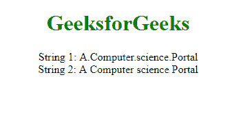
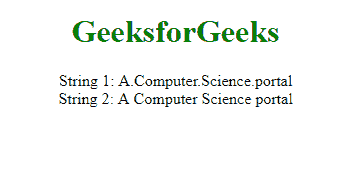

# 如何用 JavaScript 替换字符串中的所有点？

> 原文:[https://www . geesforgeks . org/如何使用 javascript 替换字符串中的所有点/](https://www.geeksforgeeks.org/how-to-replace-all-dots-in-a-string-using-javascript/)

有一些方法可以替换**点(。)**在字符串中。

*   **replace():**
    The **string.replace()** function is used to *replace a part of the given string with some another string or a regular expression*. The original string will remain unchanged.

    **语法:**

    ```
    str.replace(A, B)
    ```

    **示例-1:** 我们正在替换圆点(。)在文本“计算机科学门户”中带有空格()。

    ```
    <!DOCTYPE html>
    <html>

    <head>
    </head>

    <body>
        <center>
            <h1 style="color:green">
              GeeksforGeeks
          </h1>
            <script>

                // Assigning a string 
                var str = 'A.Computer.science.Portal';

                // Calling replace() function 
                var res = str.replace(/\./g, ' ');

                // Printing original string
                document.write("String 1: " + str);

                // Printing replaced string
                document.write("<br>String 2: " + res);

            </script>
        </center>
    </body>

    </html>
    ```

    **输出:**
    

*   **Split() and Join():** We can split up strings of text with the Javascript split method and join strings using the replace characters with the join method.

    **语法:**

    ```
    string.split('.').join(' ');
    ```

    **示例-2:** 我们正在替换圆点(。)用空格( )使用拆分和连接。

    ```
    <!DOCTYPE html>
    <html>
       <head>
       </head>
       <body>
           <center>
          <h1 style="color:green">GeeksforGeeks</h1>
          <script>

              // Assigning a string 
              let str = 'A.Computer.Science.portal';

              // Calling split(), join() function 
              let newStr = str.split('.').join(' ');

              // Printing original string
             document.write("String 1: "+str);

             // Printing replaced string
             document.write("<br>String 2: "+newStr);
          </script>
          </center>
       </body>
    </html>
    ```

    **输出:**
    