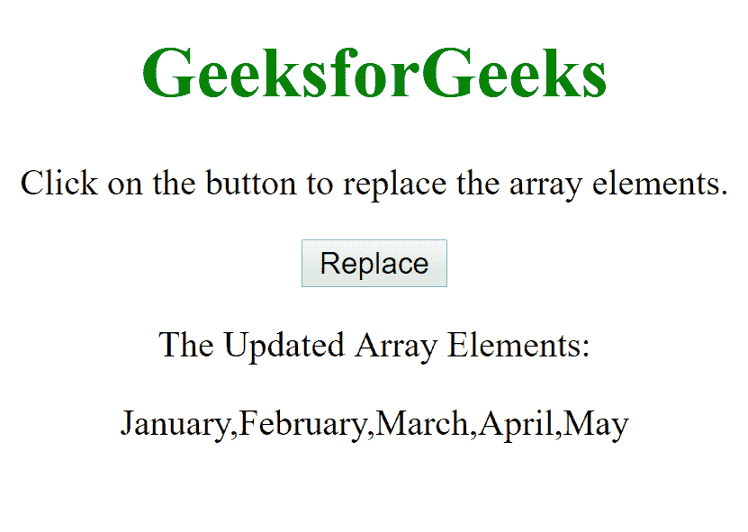
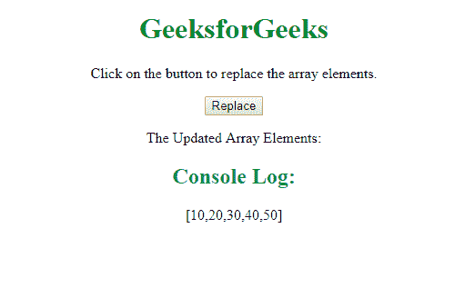

# 如何在 JavaScript 中替换数组中的项目？

> 原文:[https://www . geesforgeks . org/如何从 javascript 数组中替换项目/](https://www.geeksforgeeks.org/how-to-replace-an-item-from-an-array-in-javascript/)

可以使用两种方法替换数组中的项目:

*   **Method 1: Using [splice()](https://www.geeksforgeeks.org/javascript-array-splice-method/) method**

    JavaScript 中的数组类型为我们提供了**拼接()**方法，该方法通过在所需/期望的索引处移除和插入新元素来帮助我们替换现有数组的项目。

    **进场:**

    *   初始化一个数组，然后我们对它应用 splice()方法，结果是在索引 1 处插入元素**“二月”**，而没有移除任何元素。
    *   在第一个拼接()之后的结果数组上应用另一个拼接()方法，以便用元素**“五月”**替换索引 4 处的元素**“六月”**(在第一个拼接()方法的输出数组中)。

    **语法:**

    ```
    Array.splice(start_index, delete_count, value1, value2, value3, ...)
    ```

    **注意:** Splice()方法从包含 *start_index* 元素开始删除数组中的零个或多个元素，并用参数列表中指定的零个或多个元素替换这些元素。
    Splice()方法直接修改数组，与名称相似的 Slice()方法不同。

    **例 1:** 下面是一些举例说明**拼接()**方法:
    这个例子说明拼接方法的简单使用。

    ```
    <!DOCTYPE html>
    <html>

    <body>
        <center>
            <h1 style="color:green">
              GeeksforGeeks
          </h1>
            <p>Click on the button to replace the array elements.
            </p>
            <button onclick="element_replace()">
                Replace
            </button>
            <p>The Updated Array Elements:</p>
            <p id="result"></p>
            <script>
                function element_replace() {

                  // Initializing the array
                  var list = ["January", 
                              "March",
                              "April",
                              "June"];

                  // splicing the array elements using splice() method
                  list.splice(1, 0, "February");
                  // expected output [January, February, March, April, June]

                  // splicing the output elements after the first splicing
                  list.splice(4, 1, "May");

                  document.getElementById(
                    "result").innerHTML = list;
                }
            </script>

        </center>
    </body>

    </html>
    ```

    **点击按钮后输出:**
    

*   **Method 2:** Using array [**map()**](https://www.geeksforgeeks.org/javascript-array-map-method/) and [**filter()**](https://www.geeksforgeeks.org/javascript-array-filter-method/) methods.

    JavaScript 中的 **map()** 方法通过对父数组中的每个元素调用特定的函数来创建一个数组。 **arr.filter()** 该函数用于从给定数组创建新数组，该数组只包含给定数组中满足自变量函数设置的条件的元素。在…的帮助下

    **进场:**

    *   初始化数组。
    *   借助**选择目标索引。地图**和**。过滤**方法。
    *   在目标索引处设置新值

    **语法:**

    ```
    ele[ele.map((x, i) => [i, x]).filter(x => x[1] == old_value)[0][0]] = new_value
    ```

    **例 2:**

    ```
    <!DOCTYPE html>
    <html>

    <body>
        <center>
            <h1 style="color:green">
              GeeksforGeeks
          </h1>
            <p>
                Click on the button to 
              replace the array elements.
            </p>
            <button onclick="element_replace()">
                Replace
            </button>
            <p>The Updated Array Elements:</p>
            <p id="result"></p>
            <script>
                function element_replace() {

                    var ele = Array(10, 20, 300, 40, 50);

                    ele[ele.map((x, i) => [i, x]).filter(
                      x => x[1] == 300)[0][0]] = 30

                    console.log(ele);
                }
            </script>

        </center>
    </body>

    </html>
    ```

    **输出:**
    

JavaScript 最出名的是网页开发，但它也用于各种非浏览器环境。您可以通过以下 [JavaScript 教程](https://www.geeksforgeeks.org/javascript-tutorial/)和 [JavaScript 示例](https://www.geeksforgeeks.org/javascript-examples/)从头开始学习 JavaScript。