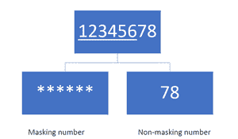
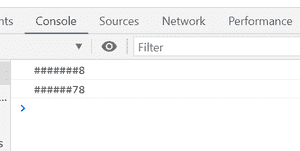

# 如何用 JavaScript 中指定的掩码字符替换除最后一个以外的字符？

> 原文:[https://www . geesforgeks . org/如何用 javascript 中指定的掩码字符替换除最后一个字符之外的字符/](https://www.geeksforgeeks.org/how-to-replace-characters-except-last-with-the-specified-mask-character-in-javascript/)

在本文中，我们给出了一个数字，任务是用 JavaScript 中指定的掩码字符替换除最后一个字符之外的字符。

**例:**我们取一个数字 *12345678* 掩蔽字符为 ***** 我们要跳过的最后一个元素的数字为 2 下图显示我们跳过最后两个元素，我们用“*****掩蔽另一个字符。



**方法:**我们将制作一个可以屏蔽字符串字符的函数，除了最后一个元素，我们将把我们的数字作为字符串给出。

*   在这个函数中，我们使用三个参数，第一个参数是我们想要屏蔽的字符串，第二个参数将指定屏蔽字符，第三个参数是您想要跳过的字符数
*   我们使用一些内置的 JavaScript 函数[切片](https://www.geeksforgeeks.org/javascript-string-slice/)来切片我们给定的字符串这里我们写 ***切片(0，-n)*** 其中 **-n** 将跳过字符串的最后一个 **n** 字符。
*   然后我们使用[替换](https://www.geeksforgeeks.org/javascript-string-replace-method/)功能，用指定的掩码替换字符。替换我们使用的所有字符**正则表达式/。/g** 在哪里**' '**将匹配任何字符，g 为全球十位。
*   现在我们必须将剩余的字符添加到掩码字符串中，因此我们再次使用**切片功能**来获取*剩余的 n 个字符*，并将其添加到掩码字符串中。

**示例:**

## java 描述语言

```
<script>
    // Function for masking the character 
    function MaskCharacter(str, mask, n = 1) {

        // Slice the string and replace with
        // mask then add remaining string
        return ('' + str).slice(0, -n)
            .replace(/./g, mask)
            + ('' + str).slice(-n);
    }

    // Number that we want to mask 
    var num = 12345678;

    // Convert number into string
    var str = num.toString();

    // Call function without giving value of n
    console.log(MaskCharacter(str, '#'));

    // Call function with value of n
    console.log(MaskCharacter(str, '#', 2));
</script>
```

**输出:**

