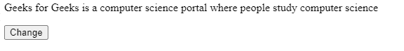
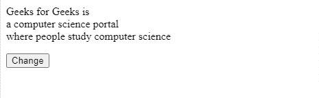

# 如何用 JavaScript 用
替换换行符？

> 原文:[https://www . geesforgeks . org/如何用-br-using-javascript 替换换行符/](https://www.geeksforgeeks.org/how-to-replace-line-breaks-with-br-using-javascript/)

给定一个多行字符串，任务是用
标记替换换行符。

**示例:**

> **输入**:【极客为极客】是
> 一个计算机科学门户
> 人们学习计算机科学的地方`
> T5】输出:【极客为极客】是**T11】br>T8】一个计算机科学门户**T13】br>T10【人们学习计算机科学的地方】****

为此，我们有以下方法:

**方法 1:** 使用正则表达式，在这个例子中，我们创建了一个段落和一个按钮，点击按钮后，我们改变(添加< br >)段落的文本。

我们正在使用 regex 的 **String.replace()** 方法用< br >替换新行。

**String.replace()** 是 JavaScript 中的一个内置方法，用于将给定字符串的一部分替换为另一个字符串或正则表达式。原始字符串将保持不变。

**例 1:**

## 超文本标记语言

```
<!DOCTYPE html>
<html>
  <body>
    <p id="para"></p>

<p>
      <button onClick="myFunc()">Change</button>
      <script>
        let str = `Geeks for Geeks is
           a computer science portal
           where people study computer science`;

        let para = document.getElementById("para");

        para.innerHTML = str;

        function myFunc() {
          // Replace the \n with <br>
          str = str.replace(/(?:\r\n|\r|\n)/g, "<br>");

          // Update the value of paragraph
          para.innerHTML = str;
        }
      </script>
    </p>

  </body>
</html>
```

**输出:**



初始输出



点击按钮后

**方法 2:** 使用拆分和连接，在这个方法中，我们从返回子字符串数组的分隔符“\n”中拆分字符串，然后我们使用连接方法连接数组并传递< br / >，这样每个连接都包含< br / >。

**例 2:**

## 超文本标记语言

```
<!DOCTYPE html>
<html>
  <body>
    <p id="para"></p>

<p>
      <button onClick="myFunc()">Change</button>
      <script>
        let str = `Geeks for Geeks is
           a computer science portal
           where people study computer science`;

        let para = document.getElementById("para");

        para.innerHTML = str;

        function myFunc() {
          // Replace the \n with <br>
          str = str.split("\n").join("<br />");
          // Update the value of paragraph
          para.innerHTML = str;
        }
      </script>
    </p>

  </body>
</html>
```

**输出:**


初始输出


点击按钮后