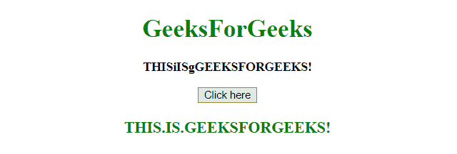
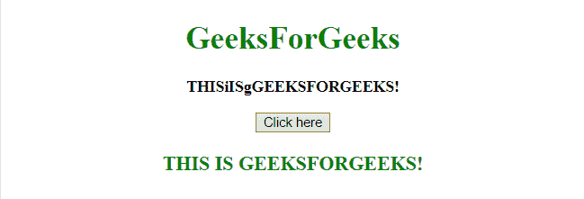

# 如何在 JavaScript 中用其他字符替换小写字母？

> 原文:[https://www . geesforgeks . org/如何用 javascript 中的其他字符替换小写字母/](https://www.geeksforgeeks.org/how-to-replace-lowercase-letters-with-an-other-character-in-javascript/)

给定一个字符串，任务是用其他字符替换字符串中的所有小写字母。用于替换字符的方法描述如下:

*   **replace() method:** This method searches a string for a defined value, or a regular expression, and returns a new string with the replaced defined value.

    **语法:**

    ```
    string.replace(searchVal, newvalue)
    ```

    **参数:**

    *   **searchVal:** 必选参数。它指定将被新值替换的值或正则表达式。
    *   **新值:**必选参数。它指定要替换为搜索值的值。

    **返回值:**它返回一个新字符串，其中定义的值已被新值替换。

**例 1:** 本例将**小写字母**替换为**。(点)**采用**代替()的方法**。

```
<!DOCTYPE HTML> 
<html> 
    <head> 
        <title> 
            Replace lowercase letters with an other characters
        </title>
    </head> 

    <body style = "text-align:center;"> 

        <h1 style = "color:green;" > 
            GeeksForGeeks 
        </h1> 

        <p id = "GFG_UP" style = "font-size: 16px; font-weight: bold;">
        </p>

        <button onclick = "gfg_Run()"> 
            Click here
        </button>

        <p id = "GFG_DOWN" style = 
            "color:green; font-size: 20px; font-weight: bold;">
        </p>

        <script>
            var el_up = document.getElementById("GFG_UP");
            var el_down = document.getElementById("GFG_DOWN");
            var str = "THISiISgGEEKSFORGEEKS!";
            el_up.innerHTML = str;

            function gfg_Run() {
                el_down.innerHTML = str.replace(/[a-z]/g, ".");
            }         
        </script> 
    </body> 
</html>                    
```

**输出:**

*   **点击按钮前:**
    
*   **点击按钮后:**
    

**示例 2:** 本示例通过转到每个字符并检查其是否为小写，将**小写字母**替换为**(' ')(空格)**，如果是，则发生替换。

```
<!DOCTYPE HTML> 
<html> 
    <head> 
        <title> 
            Replace lowercase letters with an other character
        </title>
    </head> 

    <body style = "text-align:center;"> 

        <h1 style = "color:green;" > 
            GeeksForGeeks 
        </h1> 

        <p id = "GFG_UP" style = "font-size: 16px; font-weight: bold;">
        </p>

        <button onclick = "gfg_Run()"> 
            Click here
        </button>

        <p id = "GFG_DOWN" style = 
            "color:green; font-size: 20px; font-weight: bold;">
        </p>

        <script>
            var el_up = document.getElementById("GFG_UP");
            var el_down = document.getElementById("GFG_DOWN");
            var str = "THISiISgGEEKSFORGEEKS!";
            el_up.innerHTML = str;

            function gfg_Run() {
                var newStr = "";

                for(var i=0; i<str.length; i++) { 
                    if (str.charCodeAt(i) >= 97 && 
                            str.charCodeAt(i) <= 122) {
                        newStr += ' ';
                    }
                    else {
                        newStr += str[i];
                    }
                }
                el_down.innerHTML = newStr;
            }         
        </script> 
    </body> 
</html>                    
```

**输出:**

*   **点击按钮前:**
    
*   **点击按钮后:**
    