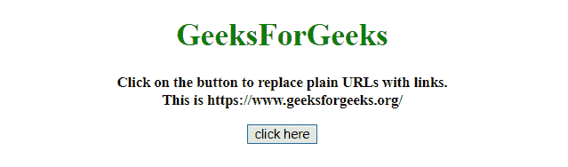
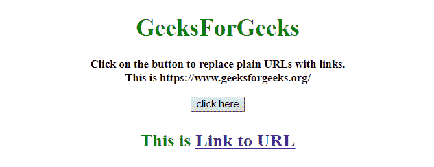
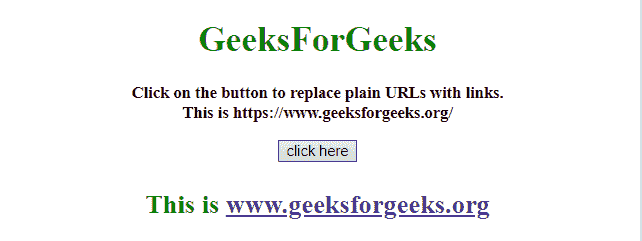

# 如何用 JavaScript 用链接替换普通 URL？

> 原文:[https://www . geesforgeks . org/如何使用 javascript 将普通 url 替换为链接/](https://www.geeksforgeeks.org/how-to-replace-plain-url-with-link-using-javascript/)

给定一个平面网址，任务是将普通网址替换为链接。这个问题可以借助正则表达式来解决。

**方法 1:**

*   正则表达式–在提供的文本中查找网址。
*   这个正则表达式解析网址，并将地址放入$1 变量。
*   获取文本中的网址后，用

**示例 1:** 该示例实现了上述方法。

```
<!DOCTYPE HTML> 
<html> 
<head> 
    <title> 
        How to replace plain URL with
        link using JavaScript ?
    </title> 
</head>

<body style = "text-align:center;"> 

    <h1 style = "color:green;"> 
        GeeksForGeeks 
    </h1> 

    <p id = "GFG_UP" style = 
            "font-size: 15px; font-weight: bold;"> 
    </p>

    <button onclick = "GFG_Fun()"> 
        click here 
    </button> 

    <p id = "GFG_DOWN" style = 
        "font-size: 24px; font-weight: bold; color: green;"> 
    </p> 

    <script> 
        var up = document.getElementById('GFG_UP'); 
        var down = document.getElementById('GFG_DOWN'); 
        var text = 'This is https://www.geeksforgeeks.org/';

        up.innerHTML = "Click on the button to replace "
                + "plain URLs with links.<br>" + text; 

        function rep(text) {

            // Put the URL to variable $1 after visiting the URL
            var Rexp = 
/((http|https|ftp):\/\/[\w?=&.\/-;#~%-]+(?![\w\s?&.\/;#~%"=-]*>))/g;

             // Replac the RegExp content by HTML element
            return text.replace(Rexp, 
                    "<a href='$1' target='_blank'>Link to URL</a>");
        }

        function GFG_Fun() { 
            down.innerHTML = rep(text);
        }
    </script> 
</body> 

</html>
```

**输出:**

*   **点击按钮前:**
    
*   **点击按钮后:**
    

**方法 2:**

*   正则表达式–在提供的文本中查找网址，并找到网址的域名。
*   获得文本中的网址后，用

**示例 2:** 该示例实现了上述方法。

```
<!DOCTYPE HTML> 
<html> 

<head> 
    <title> 
        How to replace plain URL with
        link using JavaScript ?
    </title> 
</head>

<body style = "text-align:center;"> 

    <h1 style = "color:green;"> 
        GeeksForGeeks 
    </h1> 

    <p id = "GFG_UP" style = 
            "font-size: 15px; font-weight: bold;"> 
    </p>

    <button onclick = "GFG_Fun()"> 
        click here 
    </button> 

    <p id = "GFG_DOWN" style = 
        "font-size: 24px; font-weight: bold; color: green;"> 
    </p> 

    <script> 
        var up = document.getElementById('GFG_UP'); 
        var down = document.getElementById('GFG_DOWN'); 
        var text = 'This is https://www.geeksforgeeks.org/';

        up.innerHTML = "Click on the button to replace "
                + "plain URLs with links.<br>" + text; 

        function rep(text) {
            // Put the URL to variable $1 and Domain name
            // to $3 after visiting the URL
            var Rexp = 
/(\b(https?|ftp|file):\/\/([-A-Z0-9+&@#%?=~_|!:,.;]*)([-A-Z0-9+&@#%?\/=~_|!:,.;]*)[-A-Z0-9+&@#\/%=~_|])/ig;

            // Replacing the RegExp content by HTML element
            return text.replace(Rexp,
                    "<a href='$1' target='_blank'>$3</a>");
        }

        function GFG_Fun() { 
            down.innerHTML = rep(text);
        } 
    </script> 
</body> 

</html>
```

**输出:**

*   **点击按钮前:**
    
*   **点击按钮后:**
    