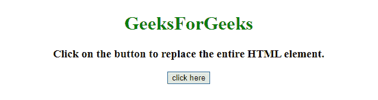

# 如何用 JavaScript 替换整个 HTML 节点？

> 原文:[https://www . geesforgeks . org/如何使用 javascript 替换整个 html 节点/](https://www.geeksforgeeks.org/how-to-replace-the-entire-html-node-using-javascript/)

给定一个 HTML 文档，工作是在 JavaScript 的帮助下用一个新的元素替换整个 HTML 元素。这里讨论几种方法。

**方法 1:**

*   将新文档作为字符串形式(例如..Str = ' < html > < /html >')。
*   使用**。在 HTML 元素上替换()方法**并用新的 HTML 文档替换它(例如..$('html ')。html(Str))。

**示例 1:** 该示例实现了上述方法。

```
<!DOCTYPE HTML>
<html>

<head>
    <title>
        Replace the entire HTML node using JavaScript.
    </title>
    <script src=
 "https://ajax.googleapis.com/ajax/libs/jquery/3.4.0/jquery.min.js">
    </script>
    <style>
        #div {
            background: green;
            height: 100px;
            width: 200px;
            margin: 0 auto;
            color: white;
        }
    </style>
</head>

<body style="text-align:center;">
    <h1 style="color:green;">  
            GeeksForGeeks  
        </h1>
    <p id="GFG_UP">
    </p>
    <button onclick="GFG_Fun();">
        click here
    </button>
    <p id="GFG_DOWN" style="color: green;">
    </p>
    <script>
        var up = document.getElementById('GFG_UP');
        var down = document.getElementById('GFG_DOWN');
        up.innerHTML = 
 "Click on the button to replace the entire HTML element.";

        function GFG_Fun() {
            var Str = 
'<!DOCTYPE HTML><html><head><title>Check if an element is a'+
' div in JavaScript.</title></head><body style = "text-align:center;">'+
'<h2 style = "color:green;">GeeksForGeeks</h2><p>This is replaced element.'+
                '</p></body>  </html>';
            $('html').html(Str);
        }
    </script>
</body>

</html>
```

**输出:**

*   **点击按钮前:**
    
*   **点击按钮后:**
    

**方法 2:**

*   将新文档作为字符串形式(例如..Str = ")。
*   使用**。打开文档上的()方法**，该方法采用两个参数(第一个是“文本/html”，第二个是“替换”)。如果我们不使用“替换”，那么方法将调用添加页面历史。所以我们必须点击两次返回到上一页。所以，替换是必要的参数通过。
*   对这个新文档使用**。编写()方法**并传递新文档。
*   使用**。关闭文档上的()方法**使其工作。

**示例 2:** 该示例实现了上述方法。

```
<!DOCTYPE HTML>
<html>

<head>
    <title>
       Replace the entire HTML node using JavaScript.
    </title>
    <script src=
"https://ajax.googleapis.com/ajax/libs/jquery/3.4.0/jquery.min.js">
    </script>
    <style>
        #div {
            background: green;
            height: 100px;
            width: 200px;
            margin: 0 auto;
            color: white;
        }
    </style>
</head>

<body style="text-align:center;">
    <h1 style="color:green;">  
            GeeksForGeeks  
        </h1>
    <p id="GFG_UP">
    </p>
    <button onclick="GFG_Fun();">
        click here
    </button>
    <p id="GFG_DOWN" style="color: green;">
    </p>
    <script>
        var up = document.getElementById('GFG_UP');
        var down = document.getElementById('GFG_DOWN');
        up.innerHTML = "Click on the button to replace the entire HTML element.";

        function GFG_Fun() {
            var Str = 
                '<!DOCTYPE HTML><html><head><title>Check if an element is a div'+
                ' in JavaScript.</title></head><body style = "text-align:center;">'+
                '<h2 style = "color:green;">GeeksForGeeks</h2><p>'+
                'This is replaced element.</p></body>  </html>';
            var newHTML = document.open("text/html", "replace");
            newHTML.write(Str);
            newHTML.close();
        }
    </script>
</body>

</html>
```

**输出:**

*   **点击按钮前:**
    
*   **点击按钮后:**
    