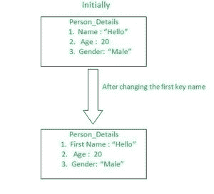

# 如何用 JavaScript 提供的值替换多个对象键的名称？

> 原文:[https://www . geesforgeks . org/如何用 javascript 提供的值替换多个对象键的名称/](https://www.geeksforgeeks.org/how-to-replace-the-names-of-multiple-object-keys-with-the-values-provided-using-javascript/)

下面的方法介绍了如何用用户使用 JavaScript 提供的值替换多个对象键的名称。

**问题陈述:**给你一个包含不同键值对的对象，其中键象征属性，值本身被称为属性值，你需要用用户使用 JavaScript 提供的名称来更改一个或多个键的原始名称。



以上面举例说明的对象为例。这个对象包含像“你好”这样的键值对。因此，让我们假设我们的目标是名称密钥，并且我们将通过以下方法将此名称密钥更改为名字密钥名称。

在直接进入解决上述问题的方法之前，让我们首先声明将要用来解决查询的对象。

**示例:**通过使用以下语法，让我们首先创建一个对象:

## java 描述语言

```
<script>
  let object = {
    name: "Hello",
    age: 20,
    gender: "Male",
  };

  console.log(object);
</script>
```

**输出:**

```
{ name: 'Hello', age: 20, gender: 'Male' }
```

现在让我们看看解决上述问题的方法。

**方法 1:**

*   这是原生方法，也是非常简单的方法。
*   在这种方法中，我们将直接选取对象键，并将选取的键的名称更改为用户提供的名称。
*   在提供密钥名之后，我们将删除先前声明的密钥名，并用新的密钥名替换它。
*   我们将在一个方法(或函数)中编写逻辑部分，并进一步调用该方法来执行我们的结果。

**例 1:**

## java 描述语言

```
<script>
  let object = {
    name: "Hello",
    age: 20,
    gender: "Male",
  };

  let renmeObjectKey = (object) => {
    object.FirstName = object.name;
    delete object.name;
  };
  renmeObjectKey(object);
  console.log(object);
</script>
```

**输出:**

```
{ age: 20, gender: 'Male', FirstName: 'Hello' }
```

现在，假设您想在对象中使用自己提供的名称来定位年龄键。

**例 2:**

## java 描述语言

```
<script>
  let object = {
    name: "Hello",
    age: 20,
    gender: "Male",
  };

  let renmeObjectKey = (object) => {
    object.FirstName = object.name;
    object.currentAge = object.age;
    delete object.name;
    delete object.age;
  };
  renmeObjectKey(object);
  console.log(object);
</script>
```

现在，除了名字键，年龄键也被替换为用户提供的新名字。

**输出:**

```
{ gender: 'Male', FirstName: 'Hello', currentAge: 20 }
```

**注意:**这里唯一可以注意到的是，对象的位置发生了变化，但其值保持不变。

**方法 2:**

*   在这种方法中，我们将声明一个完全负责执行我们的结果的方法。
*   在这个方法的参数中，我们将传递两个参数，第一个是 keysMap 对象，我们将从用户那里接受它，用户实际上包含新的键名，它将从以前的键名中替换，第二个是我们引用的对象。
*   现在在该方法中，我们将使用 Object.keys()，它将首先接受我们的对象，并将所有的对象键作为目标，然后我们将对它执行 reduce()，它将接受两件事:第一是累加器值，它将作为我们的结果变量，第二是我们当前目标的键。
*   然后，我们将编写我们的逻辑部分，为此，我们将首先考虑我们的扩展操作符，它将把我们的对象扩展成一个数组，然后我们将呈现出对象键，并用自己传递的键名替换它。
*   然后我们将在一个新的变量中传递我们的方法，我们将把这个变量声明为我们的结果变量，然后将 console.log()作为我们的结果。

**示例:**

## java 描述语言

```
<script>
  let object = {
    name: "Hello",
    age: 20,
    gender: "Male",
  };

  let renameKeys = (keysMap, object) =>
    Object.keys(object).reduce(
      (acc, key) => ({
        ...acc,
        ...{ [keysMap[key] || key]: object[key] },
      }),
      {}
    );

  let result = renameKeys({ name: "FirstName" }, object);
  console.log(result);
</script>
```

**输出:**

```
{ FirstName: 'Hello', age: 20, gender: 'Male' }
```

**注意:**这种方法将保留键的位置以及值。