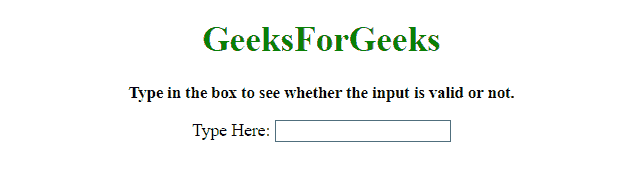
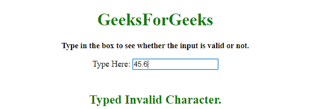

# 如何限制输入框只允许数字和小数点 JavaScript？

> 原文:[https://www . geesforgeks . org/如何限制输入框只允许数字和小数点 javascript/](https://www.geeksforgeeks.org/how-to-restrict-input-box-to-allow-only-numbers-and-decimal-point-javascript/)

任务是当用户在输入框中输入内容时验证输入。这里我们只允许十进制和整数，不允许任何其他符号。这里讨论了一些技巧。

**方法 1:**

*   验证输入的正则表达式。
*   每次输入一个字符，整个输入都会与正则表达式匹配以检查有效性。
*   如果有效，使字符有效，并添加到输入中，否则无效。

**示例 1:** 这个示例使用了上面讨论的使用 JavaScript 的方法。

```
<!DOCTYPE HTML>
<html>

<head>
    <title>
        How to restrict input box to allow
      only numbers and decimal point JavaScript?
    </title>
</head>

<body style="text-align:center;"
      id="body">

    <h1 id="h1"
        style="color:green;">  
            GeeksForGeeks  
        </h1>
    <p id="GFG_UP" 
       style="font-size: 15px; 
              font-weight: bold;">
    </p>
    <form>
        Type Here:
        <input id="input"
               oninput="valid(this)"
               type="text">
    </form>
    <br>
    <p id="GFG_DOWN" 
       style="font-size: 23px;
              font-weight: bold; 
              color: green; ">
    </p>
    <script>
        var el_up = document.getElementById("GFG_UP");
        var el_down = document.getElementById("GFG_DOWN");
        el_up.innerHTML = 
          "Type in the box to see whether the input is valid or not.";
        var RegExp = new RegExp(/^\d*\.?\d*$/);
        var val = document.getElementById("input").value;

        function valid(elem) {
            if (RegExp.test(elem.value)) {
                val = elem.value;
                el_down.innerHTML = "Typed Valid Character.";
            } else {
                elem.value = val;
                el_down.innerHTML = "Typed Invalid Character.";
            }
        }
    </script>
</body>

</html>
```

**输出:**

*   **点击按钮前:**
    
*   **点击按钮后:**
    

**方法 2:**

*   每次输入字符时，都会检查该字符是否有效。
*   这个例子也是检查输入的小数位数，一个不能输入 2 个小数。
*   如果字符有效，则添加到输入中，否则不添加。

**示例 2:** 这个示例使用了上面讨论的使用 JQuery 的方法。

```
<!DOCTYPE HTML>
<html>

<head>
    <title>
        How to restrict input box to allow
      only numbers and decimal point JavaScript?
    </title>
</head>

<body style="text-align:center;"
      id="body">
    <h1 id="h1"
        style="color:green;">  
            GeeksForGeeks  
        </h1>
    <p id="GFG_UP" 
       style="font-size: 15px; 
              font-weight: bold;">
    </p>
    <form>
        Type Here:
        <input id="input"
               onkeypress="return GFG_Fun(this, event)" 
               type="text">
    </form>
    <br>
    <p id="GFG_DOWN" 
       style="font-size: 23px; 
              font-weight: bold; 
              color: green; ">
    </p>
    <script>
        var el_up = document.getElementById("GFG_UP");
        var el_down = document.getElementById("GFG_DOWN");
        el_up.innerHTML = 
          "Type in the box to see whether the input is valid or not.";

        function isValid(el, evnt) {
            var charC = (evnt.which) ? evnt.which : evnt.keyCode;
            if (charC == 46) {
                if (el.value.indexOf('.') === -1) {
                    return true;
                } else {
                    return false;
                }
            } else {
                if (charC > 31 && (charC < 48 || charC > 57))
                    return false;
            }
            return true;
        }

        function GFG_Fun(t, evnt) {
            var a = isValid(t, evnt);
            if (a) {
                el_down.innerHTML = "Typed Valid Character.";
            } else {
                el_down.innerHTML = "Typed Invalid Character.";
            }
            return a;
        }
    </script>
</body>

</html>
```

**输出:**

*   **点击按钮前:**
    
*   **点击按钮后:**
    