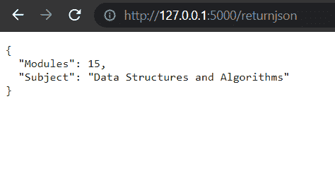

# 如何从 Flask API 返回 JSON 响应？

> 原文:[https://www . geesforgeks . org/how-return-a-JSON-response-form-a-flask-API/](https://www.geeksforgeeks.org/how-to-return-a-json-response-form-a-flask-api/)

Flask 是设计 REST API 最广泛使用的 python 微框架之一。在本文中，我们将学习如何在烧瓶的帮助下创建一个简单的 REST API，该 API 返回一个简单的 JSON 对象。

**先决条件:**[REST API 简介](https://www.geeksforgeeks.org/rest-api-introduction/)

**什么是 REST API？**

REST 代表表示状态转移，是现代网络开发中使用的一种架构风格。它为 web 应用程序定义了一组发送和接收数据的规则/约束。在本文中，我们将使用 Flask 框架在 Python 中构建一个 REST API。Flask 是一个流行的构建 web 应用程序的微型框架。

**方法:**我们将编写一个简单的 flask API，使用两种方法返回一个 JSON 响应:

1.  使用 Flask jsonify 对象。
2.  将 flask_restful 库与 flask 一起使用。

**所需库:**

*   使用以下命令安装 python *烧瓶*库:

```
pip install Flask
```

*   使用以下命令安装*烧瓶式*库:

```
pip install Flask-RESTful
```

**方法 1:使用 flask jsonify 对象–**在这种方法中，我们将使用 Flask jsonify 方法返回一个 JSON 响应。在这种方法中，我们不打算使用烧瓶-restful 库。

*   创建一个名为“main.py”的新 python 文件。
*   从烧瓶框架中导入烧瓶、jsonify 和请求。
*   使用以下语法将 web 应用注册到应用变量中。

```
app = Flask(__name__)
```

*   创建一个名为“ReturnJSON”的新函数。这个函数将返回样本 JSON 响应。
*   使用以下语法将“ReturnJSON”函数路由到所需的网址。

```
@app.route('/path_of_the_response', methods = ['GET'])
def ReturnJSON():
  pass
```

*   在“ReturnJSON”函数中，如果请求方法是“GET”，那么创建一个包含两个消息元素的 python 字典。
*   jsonify python 字典并返回它。
*   使用以下命令构建烧瓶应用程序。

```
if __name__=='__main__':
    app.run(debug=True)
```

*   在终端或集成开发环境中运行“main.py”文件。

**代码:**

## 蟒蛇 3

```
from flask import Flask,jsonify,request

app =   Flask(__name__)

@app.route('/returnjson', methods = ['GET'])
def ReturnJSON():
    if(request.method == 'GET'):
        data = {
            "Modules" : 15,
            "Subject" : "Data Structures and Algorithms",
        }

        return jsonify(data)

if __name__=='__main__':
    app.run(debug=True)
```

**输出:**



**方法 2:将 flask_restful 库与 Flask–**一起使用在这种方法中，我们将借助 flask-restful 库创建一个简单的 JSON 响应。下面讨论这些步骤:

*   创建一个名为“main.py”的新 python 文件。
*   从烧瓶框架导入烧瓶。
*   从“烧瓶 _restful”库中导入应用编程接口和资源。
*   使用以下语法将 web 应用注册到应用变量中。

```
app = Flask(__name__)
```

*   使用“flask_restful”库的 API 方法将 app 变量注册为 API 对象。

```
api = Api(app)
```

*   创建名为“ReturnJSON”的资源类。
*   在资源内部，类创建一个“get”方法。
*   从“get”方法返回带有简单 JSON 响应的字典。
*   使用 add_resource 方法将资源类添加到 API 中。
*   使用以下命令构建烧瓶应用程序。

```
if __name__=='__main__':
    app.run(debug=True)
```

*   在终端或集成开发环境中运行“main.py”文件。

**代码:**

## 蟒蛇 3

```
from flask import Flask
from flask_restful import Api, Resource

app =   Flask(__name__)

api =   Api(app)

class returnjson(Resource):
    def get(self):
        data={
            "Modules": 15, 
            "Subject": "Data Structures and Algorithms"
        }
        return data

api.add_resource(returnjson,'/returnjson')

if __name__=='__main__':
    app.run(debug=True)
```

**输出:**

