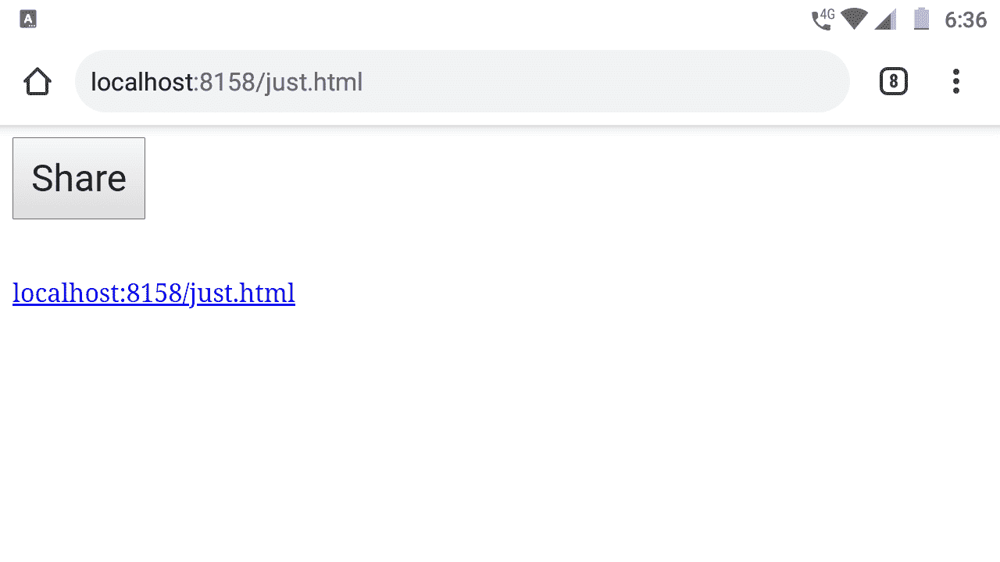

# 如何使用 JavaScript 返回共享按钮的当前 URL？

> 原文:[https://www . geesforgeks . org/如何使用 javascript 返回当前 url 以获取共享按钮/](https://www.geeksforgeeks.org/how-to-return-current-url-for-a-share-button-using-javascript/)

在这篇文章中，我们将学习网站上显示的共享按钮背后的逻辑，这些按钮可用于在其他社交媒体平台上共享一篇文章或网站的完整网址。我们将通过几个步骤来了解这一点。

**第一步:**首先，我们需要创建一个 HTML 文件，它将在浏览器上显示所有内容。

## 超文本标记语言

```html
<!DOCTYPE html>
<html>

<head>
    <style type="text/css" media="all">
        /* This CSS is optional */
        #share-button {
            padding: 10px;
            font-size: 24px;
        }
    </style>
</head> 

<body>
    <!-- The share button -->    
    <button id="share-button">Share</button>

    <!-- These line breaks are optional -->
    <br/>
    <br/>
    <br/>

    <!-- The anchor tag for the sharing link -->
    <a href="#"></a>
    <script type="text/javascript" charset="utf-8">
        // We will write the javascript code here
    </script>    
</body>

</html>
```

**输出:**


HTML 代码的结果。

以上是 HTML 代码和**我们将从这一点**开始只编写 JavaScript 部分。

**第二步:**在这一步中，我们将添加 JavaScript 代码，该代码将以链接的形式显示当前网页的 URL。

*   这里的“**窗口**是一个全局对象，它由各种属性组成，其中位置是一个这样的属性，href 属性为我们提供了完整的网址以及使用的路径和协议。
*   但是我们不需要 https://(协议)，所以我们使用 JavaScript 的 slice 方法删除它。

## 超文本标记语言

```html
<!DOCTYPE html>
<html>

<head>
    <style type="text/css" media="all">
        /* This CSS is optional */
        #share-button {
            padding: 10px;
            font-size: 24px;
        }
    </style>
</head> 

<body>
    <!-- The share button -->    
    <button id="share-button">Share</button>

    <!-- These line breaks are optional -->
    <br/>
    <br/>
    <br/>

    <!-- The anchor tag for the sharing link -->
    <a href="#"></a>
    <script type="text/javascript" charset="utf-8">
        // Make sure you write this code inside the 
        // script tag of your HTML file 

        // Storing the URL of the current webpage
        const URL = window.location.href.slice(7);
        // We used the slice method to remove 
        // the 'http://' from the prefix 

        // Displaying the current webpage link
        // on the browser window 
        const link = document.querySelector('a');
        link.textContent = URL;
        link.href = URL;

        // Displaying in the console
        console.log(URL);
    </script>    
</body>

</html>
```

**输出:**



步骤 2 的结果

**第三步:**我们不希望浏览器窗口一加载就显示网址，而是希望点击按钮就显示。因此，我们将向按钮添加一个事件侦听器，然后在单击按钮时显示 URL

## 超文本标记语言

```html
<!DOCTYPE html>
<html>

<head>
    <style type="text/css" media="all">
        /* This CSS is optional */
        #share-button {
            padding: 10px;
            font-size: 24px;
        }
    </style>
</head> 

<body>
    <!-- The share button -->    
    <button id="share-button">Share</button>

    <!-- These line breaks are optional -->
    <br/>
    <br/>
    <br/>

    <!-- The anchor tag for the sharing link -->
    <a href="#"></a>
    <script type="text/javascript" charset="utf-8">
        // Make sure you write this code inside the 
        // script tag of your HTML file 

        // Storing the URL of the current webpage
        const URL = window.location.href.slice(7);
        // We used the slice method to remove 
        // the 'http://' from the prefix 

        // Displaying the current webpage link
        // on the browser window 
        const link = document.querySelector('a');
        const button = document.querySelector('#share-button');

        // Adding a mouse click event listener to the button
        button.addEventListener('click', () => {
            // Displaying the current webpage link
            // on the browser window 
            link.textContent = URL;
            link.href = URL;

            // Displaying in the console
            console.log(URL);
        });
    </script>    
</body>

</html>
```

**输出:**

<video class="wp-video-shortcode" id="video-495876-1" width="640" height="360" preload="metadata" controls=""><source type="video/mp4" src="https://media.geeksforgeeks.org/wp-content/uploads/20201003214526/VID-20201003-WA0009.mp4?_=1">[https://media.geeksforgeeks.org/wp-content/uploads/20201003214526/VID-20201003-WA0009.mp4](https://media.geeksforgeeks.org/wp-content/uploads/20201003214526/VID-20201003-WA0009.mp4)</video>

**第四步:**现在点击按钮就会显示链接，但是我们不需要当前页面的链接，而是在社交媒体平台上共享当前网页的链接。所以我们更新代码如下。

## 超文本标记语言

```html
<!DOCTYPE html>
<html>

<head>
    <style type="text/css" media="all">
        /* This CSS is optional */
        #share-button {
            padding: 10px;
            font-size: 24px;
        }
    </style>
</head> 

<body>
    <!-- The share button -->    
    <button id="share-button">Share</button>

    <!-- These line breaks are optional -->
    <br/>
    <br/>
    <br/>

    <!-- The anchor tag for the sharing link -->
    <a href="#"></a>
    <script type="text/javascript" charset="utf-8">
        // Make sure you write this code inside the 
        // script tag of your HTML file 

        // Facebook share url
        const fbShare = "https://www.facebook.com/sharer/sharer.php?u="

        // Storing the URL of the current webpage
        const URL = window.location.href.slice(7);
        // We used the slice method to remove 
        // the 'http://' from the prefix 

        // Displaying the current webpage link
        // on the browser window 
        const link = document.querySelector('a');
        const button = document.querySelector('#share-button');

        // Adding a mouse click event listener to the button
        button.addEventListener('click', () => {
            // Displaying the current webpage link
            // on the browser window 
            link.textContent = fbShare+URL;
            link.href = fbShare+URL;

            // Displaying in the console
            console.log(fbShare+URL);
        });
    </script>    
</body>

</html>
```

**输出:**

<video class="wp-video-shortcode" id="video-495876-2" width="640" height="360" preload="metadata" controls=""><source type="video/mp4" src="https://media.geeksforgeeks.org/wp-content/uploads/20201003215223/VID-20201003-WA00131.mp4?_=2">[https://media.geeksforgeeks.org/wp-content/uploads/20201003215223/VID-20201003-WA00131.mp4](https://media.geeksforgeeks.org/wp-content/uploads/20201003215223/VID-20201003-WA00131.mp4)</video>

这就是我们如何获得共享网址，而不是显示共享网址，我们实际上可以在按钮内使用它来直接将用户重定向到特定的社交媒体平台。此外，我还使用了脸书分享网址，几乎所有的社交媒体平台都有类似的网址，你可以随意尝试，并想出你自己的分享按钮。这篇文章已经涵盖了使用 JavaScript 共享当前网页网址的所有要点。